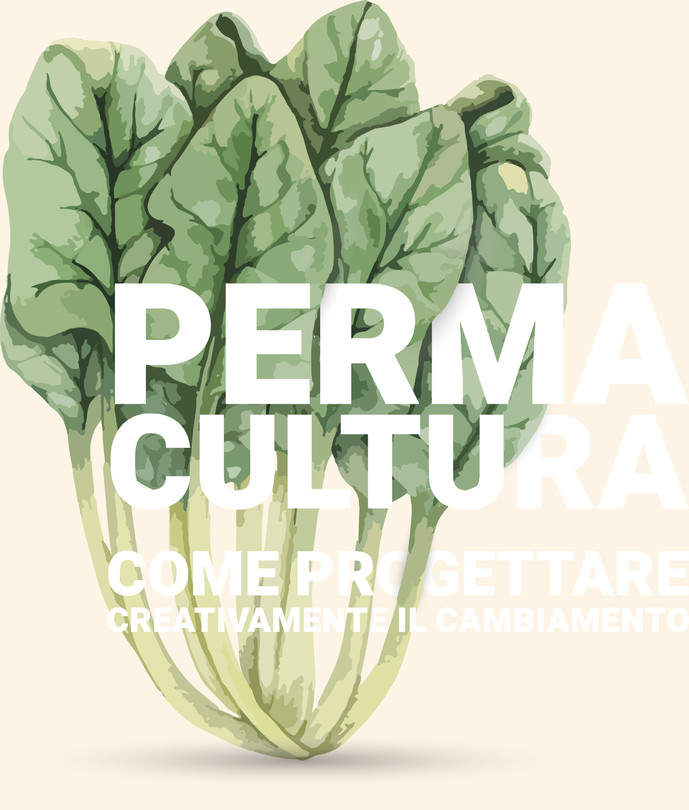

<Row $top={6} $bottom={3} $valign="center">
<Col md={8}>
<EntryInfo variant="upcoming" label="Quando" value="dal 24 al 27 luglio 2020"/>
<EntryInfo variant="duration" label="inizio" value="alle 18:00 di venerdì"/>
<EntryInfo variant="duration" label="fine" value="lunedì dopo pranzo"/>
<EntryInfo variant="target" value="chiunque"/>
<EntryInfo variant="price" value="[vedi dettagli](#costi)"/>
<EntryInfo variant="teacher" value="[Elisabetta Dallavalle](#elisabetta-dallavalle) e [Francesca Simonetti](#francesca-simonetti)"/>
<EntryInfo variant="participants" value="tra i 12 e i 20"/>
</Col>
<Col md={4}>
<Alert $bottom={3} color="green">

**Iscrizioni aperte!** [vedi dettagli](#iscrizione)

</Alert>
<Footnote>

Abbiamo raggiunto il numero di adesioni necessario, il corso partirà!

</Footnote>
</Col>
</Row>

<Row $top={6} $bottom={3} $valign="center">
<Col md={6} $initial>

La **permacultura** è un metodo di progettazione per una vita sostenibile, fondata su principi etici ed ecologici con un approccio pratico alla vita quotidiana. Grazie alla sua impostazione multidisciplinare ed olistica, è in grado di offrire soluzioni e opportunità che permettono di affrontare in modo creativo la progettazione della nostra vita, del luogo in cui viviamo e delle persone che lo abitano.
In questo periodo storico, oltre alle problematiche legate al cambiamento climatico, alla semplificazione dei sistemi agro—forestali, alla riduzione della biodiversità e alla disgregazione socioeconomica, si sono aggiunte ulteriori difficoltà legate alla pandemia in atto.
Emerge sempre di più l’importanza di rispondere positivamente a questi elementi esterni destabilizzanti, attraverso la consapevolezza, la visione e la progettazione della vita che vogliamo, lottando con la natura e non contro di essa, per creare sistemi sostenibili e resilienti.
Questo corso introduttivo costituisce il **primo modulo del corso di progettazione di 72 ore**. Inoltre, considerando l’importanza degli aspetti sociali nel dare forza agli individui, soprattutto nei momenti di crisi e di cambiamento, durante il corso verrà dato un focus particolare alla **progettazione di comunità resilienti**.

</Col>
<Col md={6}>

<Footnote>
Il corso è aperto a tutti e non sono richieste conoscenze specifiche.
</Footnote>

<ButtonLink anchor="programma">Vedi il programma completo</ButtonLink>

</Col>
</Row>

<Row>
<Col $columned>

### Programma

L’interdisciplinarietà, l’approccio sistemico ed integrato della Permacultura, rendono questo corso unico, grazie al quale, si acquisisce la capacità di “saper guardare” al mondo che ci circonda con un approccio più olistico, sostenibile e resiliente.
Durante questo corso saranno trattati gli argomenti relativi al primo modulo del corso di progettazione in Permacultura, con un particolare focus sugli aspetti legati alla creatività come risposta ai momenti di crisi, attraverso il coinvolgimento della comunità locale.

#### Argomenti trattati

1. Permacultura: definizioni e ambiti
2. Principi (etici, attitudinali, ecologici, di progettazione)
3. Ecologia
4. Spirali di distruzione e rigenerazione
5. Osservazione dei modelli della natura
6. Bioregione/Biodistretto
7. Economia etica
8. Ciclo progettuale, strategie e metodi di progettazione
9. Progettazione focalizzata sulla creazione di una comunità resiliente, sostenibile e autosufficiente.

#### Modalità d'insegnamento

Il metodo utilizzato sarà quello dell’apprendimento attivo, metodo in grado di acquisire la consapevolezza degli argomenti trattati, attraverso la mente, il corpo e le emozioni, favorendo, nello stesso tempo, lo sviluppo  dell’osservazione e della creatività. Pertanto, le lezioni teoriche saranno alternate ad attività pratiche, dimostrative ed esperienziali.
Un altro obiettivo dei nostri corsi è quello di imparare a costruire un organismo (comunità), cioè un insieme di individui in grado di collaborare con sinergia, pieno rispetto e gratitudine nei confronti della diversità individuale, ottimizzando così la soluzione dei problemi. Verrà quindi continuamente stimolata la creazione di relazione fra i partecipanti, attraverso lavori di coppia, a piccoli gruppi ed in plenaria.

</Col>
</Row>

<SectionTitle>con le insegnanti</SectionTitle>
<SectionSubtitle>Elisabetta Dallavalle e Francesca Simonetti</SectionSubtitle>

<Row $top={6} $bottom={3} $valign="center">
<Col xm={9} sm={8} md={7}>

### Elisabetta Dallavalle

Ha conseguito la laurea in scienze agrarie e il dottorato di ricerca presso l’Università di Bologna, dove ha praticato attività scientifica e didattica nel settore della patologia vegetale e della micologia, per oltre vent’anni. Svolge la professione di agronomo libero professionista nella progettazione e nella divulgazione di sistemi ambientali sostenibili e si occupa, in collaborazione con Università ed Enti di ricerca, di sperimentazioni e ricerche in agricoltura biologica. E’ docente e progettista accreditata in Permacultura Applicata. Attualmente è presidente dell’[Accademia Italiana di Permacultura](https://www.permacultura.it/).

</Col>
<Col xm={3} sm={4} md={5}>
<ImgRounded>

</ImgRounded>
</Col>
</Row>

<Row $top={6} $bottom={3} $valign="center">

<Col xm={3} sm={4} md={5} orderxs={2}>
<ImgRounded>

</ImgRounded>
</Col>
<Col xm={9} sm={8} md={7}>

### Francesca Simonetti

Agronoma e co-fondatrice di NatureDesigns, opera come libero professionista da più di venti anni nel settore agro-forestale e della sostenibilità ambientale per clienti privati ed enti pubblici. Dal 2008 ha integrato nella sua professione, la Permacultura. Insegnante e progettista, acuta osservatrice ed amministratrice, Francesca ha abbinato i suoi interessi per gli aspetti sociali, spirituali e scientifici con la Permacultura. [greengaiaproject.org](http://greengaiaproject.org) - [naturedesignsjohnfranci.com](https://naturedesignsjohnfranci.com)

</Col>
</Row>

<SectionTitle>informazioni su </SectionTitle>
<SectionSubtitle>Modalità di iscrizione, costi e logistica</SectionSubtitle>

<Row $top={6} $bottom={3} $valign="center">

<Col id="iscrizione" md={5}>

#### Iscrizioni aperte

### fino all'ultimo!

<Alert $top={3} color="lightblue">

[Scarica il modulo di iscrizione](/documents/modulo-iscrizione-corso-permacultura-2020.pdf) da compilare in stampatello, firmare e inviare a [amicidellaschola@gmail.com](mailto:amicidellaschola@gmail.com)

</Alert>
</Col>
<Col id="costi" md={7}>
<EntryInfo variant="teacher" label="Corso" value="130 €"/>
<EntryInfo variant="location" label="Pernottamento" value="20 € a notte"/>
<EntryInfo variant="participants" label="Vitto" value="colazione 5€, pranzo 10€, cena 10€"/>
<Footnote>

Le merende sono incluse nei costi di pernottamento.
Per chi non si ferma a dormire è previsto un contributo di 10€ al giorno (merende incluse).

</Footnote>
<Footnote $top={3}>

Le [camere da letto](/spazi/camere) sono triple con bagno in camera. È possibile richiedere una stanza singola previo accordo e disponibilità.  

</Footnote>
</Col>
</Row>

<ButtonLink anchor="contattaci">Contattaci per info e iscrizioni</ButtonLink>

<FormContact id="contattaci" phoneable emailable subject="Corso di Permacultura" subtitle="Contattaci" title="per iscrizioni o per richiedere maggiori informazioni" msg="Ciao, vi scrivo riguardo al corso 'Permacultura: progettare creativamente il cambiamento'..."></FormContact>

<QuoteAuthor $top={6}>

L'illustrazione delle coste è [disegnata da rawpixel.com / Freepik](http://www.freepik.com)

</QuoteAuthor>