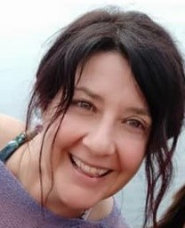

<Row>
  <Col $initial $top={4}>
    Biodanza (dal greco *Bios*, vita, danza della vita) è un sistema per lo sviluppo armonico della persona, finalizzato a creare condizioni che possano favorire la capacità di ogni individuo di vivere pienamente il momento presente, sviluppando consapevolezza di sé, imparando a ristabilire un sano equilibrio psicofisico, scoprendo i propri potenziali inespressi.
  </Col>
</Row>

<Row $top={3} $bottom={3} $valign="center">
  <Col md={6}>
    Il corso dura da settembre a giugno, con cadenza settimanale e le sessioni durano circa due ore inclusa la condivisione iniziale e una breve parte teorica sul tema della serata.

    <EntryInfo variant="upcoming" value="ogni giovedì dalle 20:45 alle 22:45" $top={3}/>
    <EntryInfo variant="duration" label="periodo" value="da settembre 2022 a giugno 2023"/>
    <EntryInfo variant="target" value="adulti, dai 18 anni, con eccezioni da concordare"/>
    <EntryInfo variant="teacher" value="[Alessandra Marra](#alessandra-marra), [studio hOMe](/partners/studio-home)" />
    <EntryInfo variant="location" label="A LaSchola" value="[Via Maroni 13, Casciago 21020, VA](https://g.page/laschola?share)"/>
    <EntryInfo variant="participants" value="minimo 8, massimo 25" $bottom={2}/>
    <EntryInfo variant="price" label="Costi" value="singola lezione 20 €"/>
    <EntryInfo variant="" label="mensile" value="(4 incontri) 70 €"/>
    <EntryInfo variant="" label="trimestrale" value="(12 incontri) 190 € + sconto del 50% per una sessione di gruppo (viaggio sciamanico, cerchi al femminile, Mindfulness)"/>
    <EntryInfo variant="" label="semestrale" value="(24 incontri) 350 euro + una prova gratuita per una sessione di gruppo (viaggio sciamanico, cerchi al femminile, Mindfulness)" $bottom={6}/>
  </Col>
  <Col md={6}>
    <Alert $bottom={3} color="lilla">
      **Iscrizioni aperte** [Contattaci per saperne di più](#contattaci)

      **Da sapere**: scegliere abbigliamento comodo, a strati e calze antiscivolo. Portare un cuscino e una copertina.
      
      **Biodanza** non prevede prestazioni né attitudini particolari né l’apprendimento di tecniche o passi di danza; è adatta a tutte le età e a tutti i generi, ma essendo la metodologia diversa per bambini e adolescenti, si accettano persone dai 18 anni in su, salvo eccezioni previo colloquio.
    </Alert>
  </Col>
</Row>
<Row>
  <Col $columned>
    Come in una serra dove vengono deposti semi cui viene donata la giusta dose di acqua, luce e nutrimento, ogni partecipante si schiude con i suoi tempi, fiorisce gradualmente, nel totale rispetto delle differenze individuali, grazie a un ambiente accogliente, protetto, non giudicante, non competitivo e alla sinergia fra tre preziosi ingredienti: la musica, il movimento, la relazione.

    Quest’ultimo ingrediente è particolarmente importante e distingue Biodanza da molte altre attività che, pur svolgendosi in gruppo, non fanno del gruppo uno strumento di lavoro: per Biodanza, tutto è relazione, tutto è parte di quell’immensa rete di interconnessioni che è la Vita, in ogni sua espressione. Ed è solo attraverso la presenza dell’altro che possiamo veramente crescere, divenire consapevoli di noi stessi, ritrovare integrità, saggezza ancestrale, compassione, accoglienza, capacità di scegliere ciò che ci aiuta a stare bene. Settimana dopo settimana, in un processo costante di trasformazione e riequilibrio, i partecipanti svilupperanno fiducia e sicurezza, rafforzeranno la loro identità, abbandoneranno le loro strutture difensive e apprenderanno dall’esperienza nuove possibilità comunicative, espressive e relazionali che renderanno le loro vite più armoniose e piene di senso, favorendo il benessere in ogni campo.

    L’approfondimento di quest’anno sarà dedicato agli oli essenziali e alle loro preziose proprietà terapeutiche. In ogni sessione, impareremo a conoscere i benefici di una singola essenza a livello fisico, energetico, emotivo e spirituale e ne incorporeremo le qualità danzando insieme. Questo costituirà un valore aggiunto rispetto ai benefici già insiti nella pratica di Biodanza.

    <QuoteAuthor>
      [Alessandra Marra](#alessandra-marra)
    </QuoteAuthor>
  </Col>
</Row>
<Row $bottom={6}>
  <Col id="contattaci">
    <SectionTitle>per info e prenotazioni</SectionTitle>
    <SectionSubtitle>contatta</SectionSubtitle>
  </Col>
  <Col md={2}></Col>
  <Col xs={3} md={2}>
    <ImgRounded>
      
    </ImgRounded>
  </Col>
  <Col xs={9} md={6}>
    ### Alessandra Marra

    Laureata in filosofia e in psicologa clinica, insegnante tutor e didatta di Biodanza, Mindfulness Teacher, terapeuta CFT, operatrice in sciamanesimo, formatrice.

    <EntryInfo variant="web" label="Studio hOMe" value="[scopri di più](/partners/studio-home)" />
    <EntryInfo variant="email" label="Email" value="[alemarra@libero.it](mailto:alemarra@libero.it)" $bottom={1}/>
    <EntryInfo variant="phone" label="Telefono" value="[328 8721571](tel:3288721571)"/>
  </Col>
</Row>