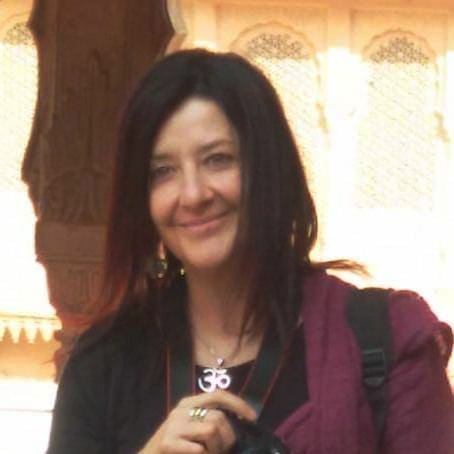

<Row>
  <Col $initial $top={4}>
    Per chiunque sia interessato a intraprendere o continuare un percorso di crescita personale, la Mindfulness e la Terapia basata sulla compassione (CFT) sono due ottimi approcci per esercitare la possibilità di vivere il qui e ora con piena consapevolezza e presenza. Il nostro obiettivo sarà passare progressivamente dalla modalità del fare alla modalità dell’essere, imparare a calmare la mente ancorandola al respiro, ai suoni, al corpo, ai nostri stati interni (sensazioni, emozioni, pensieri), abbandonare i piloti automatici e le difese per imparare a individuare le nostre modalità reattive e trasformarle in libere scelte utili per noi e per chi ci circonda.
  </Col>
</Row>

<Row $top={3} $bottom={3} $valign="center">
  <Col md={6}>
    <EntryInfo variant="upcoming" value="ogni martedì dalle 20:30 alle 22:00" $top={3}/>
    <EntryInfo variant="duration" label="periodo" value="da settembre 2022 a giugno 2023"/>
    <EntryInfo variant="target" value="adulti, dai 18 anni, con eccezioni da concordare"/>
    <EntryInfo variant="teacher" value="[Alessandra Marra](#alessandra-marra), [studio hOMe](/partners/studio-home)" />
    <EntryInfo variant="location" label="A LaSchola" value="[Via Maroni 13, Casciago 21020, VA](https://g.page/laschola?share)"/>
    <EntryInfo variant="participants" value="minimo 8, massimo 25" $bottom={2}/>
    <EntryInfo variant="price" label="Costi" value="singola lezione 20 €"/>
    <EntryInfo variant="" label="mensile" value="(4 incontri) 70 €"/>
    <EntryInfo variant="" label="trimestrale" value="(12 incontri) 190 € + sconto del 20% per una sessione di gruppo (viaggio sciamanico, cerchi al femminile, Mindfulness)"/>
    <EntryInfo variant="" label="semestrale" value="(24 incontri) 350 euro + una prova gratuita per una sessione di gruppo (viaggio sciamanico, cerchi al femminile, Mindfulness)" $bottom={6}/>
  </Col>
  <Col md={6}>
    <Alert $bottom={3} color="lilla">
      **Iscrizioni aperte** [Contattaci per saperne di più](#contattaci)

      **Da sapere**: scegliere abbigliamento comodo, a strati e calze antiscivolo. Portare un cuscino (ideale uno zafu) o una panchetta da meditazione, una copertina, un quaderno per gli appunti e una biro. Corso adatto a tutte le età e a tutti i generi.
    </Alert>
  </Col>
</Row>
<Row>
  <Col $columned>
    Imparare a stare con quello che accade, mentre accade, qualsiasi cosa sia, in maniera intenzionale, curiosa, gentile e non giudicante potrà davvero cambiare le nostre vite. Lavoreremo sulla modalità di approcciarci alla realtà interna ed esterna, abbandonando l’illusione del controllo, esercitando la compassione, l’equanimità, l’amorevole gentilezza, sperimentando come i processi siano più importanti dei contenuti.

    Scopriremo allora che la sofferenza nasce, come dice la psicologia buddhista, dall’ignoranza e dalla nostra tendenza a sviluppare attaccamento per ciò che ci procura piacere e avversione per ciò che ci disturba. E che abbiamo una via alternativa da percorrere per poterci sentire al sicuro, in pace, sereni e mantenerci il più possibile consapevoli, in un corpo sano e in una mente presente a se stessa.

    <QuoteAuthor>
      [Alessandra Marra](#alessandra-marra)
    </QuoteAuthor>
  </Col>
</Row>
<Row>
  <Col id="contattaci">
    <SectionTitle>per info e prenotazioni</SectionTitle>
    <SectionSubtitle>contatta</SectionSubtitle>
  </Col>
  <Col md={2}></Col>
  <Col xs={3} md={2}>
    <ImgRounded>
      
    </ImgRounded>
  </Col>
  <Col xs={9} md={6}>
    ### Alessandra Marra

    Laureata in filosofia e in psicologa clinica, insegnante tutor e didatta di Biodanza, Mindfulness Teacher, terapeuta CFT, operatrice in sciamanesimo, formatrice.

    <EntryInfo variant="email" label="Email" value="[alemarra@libero.it](mailto:alemarra@libero.it)" $bottom={1}/>
    <EntryInfo variant="phone" label="Telefono" value="[328 8721571](tel:3288721571)" $bottom={6}/>
  </Col>
</Row>