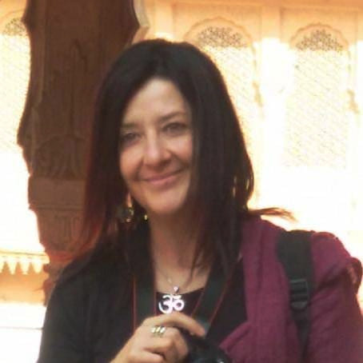

<Row>
  <Col $initial $top={4}>
    Biodanza è un sistema per lo sviluppo armonico della persona che mira a creare condizioni per favorirne la “fioritura” e il benessere. Proprio come in una serra dove ogni seme riceve cure appropriate per schiudersi, ogni partecipante entra in contatto gradualmente con i propri potenziali inespressi, nel pieno rispetto dei tempi individuali, grazie a un clima accogliente, non giudicante, non competitivo e alla sinergia fra tre preziosi ingredienti: la musica, il movimento e la relazione. Totalmente calati nel qui e ora di ogni sessione, i partecipanti riscoprono l’importanza di rispettare i ritmi fisiologici della Vita, di ascoltare il corpo e la saggezza di istinti a lungo repressi; riapprendono l’alfabeto dell’affettività e la sacralità dei gesti, coltivano l’accoglienza e la consapevolezza dell’interconnessione di tutte le cose, rafforzano la fiducia in se stessi e nel prossimo.

    <QuoteAuthor>
      [Alessandra Marra](#alessandra-marra)
    </QuoteAuthor>
  </Col>
</Row>

<Row $bottom={3} $valign="center">
  <Col md={6}>
    <EntryInfo variant="duration" label="periodo" value="da settembre 2023 a giugno 2024" $top={3}/>
    <EntryInfo variant="upcoming" value="ogni giovedì dalle 20:45 alle 22:45"/>
    <EntryInfo variant="target" value="adulti, dai 18 anni, con eccezioni da concordare"/>
    <EntryInfo variant="teacher" value="[Alessandra Marra](#alessandra-marra) e [Sonia Gallozzi](#sonia-gallozzi)" />
    <EntryInfo variant="web" value="https://homesentieridiconsapevolezza.com" />
    <EntryInfo variant="location" label="A LaSchola" value="[Via Maroni 13, Casciago 21020, VA](https://g.page/laschola?share)" $bottom={6}/>
  </Col>
  <Col md={6} $initial>
    L'approfondimento di quest'anno sarà dedicato alla gemmoterapia, parte della moderna fitoterapia che si occupa di educazione alla salute ed esercita un profondo effetto a livello psicofisico e sottile, potenziando la vitalità cellulare e la risposta creativa dell'organismo. Ogni sera entreremo in contatto con l'energia di una singola gemma vegetale, assaggiando i rimedi, conoscendone e danzandone le proprietà.
  </Col>
</Row>
<Row>
  <Col id="contattaci">
    <SectionTitle>per info e prenotazioni</SectionTitle>
    <SectionSubtitle>contatta</SectionSubtitle>
  </Col>
  <Col md={2}></Col>
  <Col xs={3} md={2}>
    <ImgRounded>
      
    </ImgRounded>
  </Col>
  <Col xs={9} md={6}>
    ### Alessandra Marra

    Laureata in filosofia e in psicologia clinica, Mindfulness Teacher, terapeuta CFT, insegnante didatta di Biodanza.

    <EntryInfo variant="web" label="Studio hOMe" value="[scopri di più](/partners/studio-home)" />
    <EntryInfo variant="email" label="Email" value="[alemarra@libero.it](mailto:alemarra@libero.it)" $bottom={1}/>
    <EntryInfo variant="phone" label="Telefono" value="[328 8721571](tel:3288721571)"/>
  </Col>
</Row>
<Row>
  <Col md={2}></Col>
  <Col xs={3} md={2}></Col>
  <Col xs={9} md={6}>
    ### Sonia Gallazzi

    Naturopata, fitoterapeuta, riflessologa, esperta in fiori di Bach, Guida Ambientale Escursionistica, raccoglitrice professionale di erbe in natura spontanea.
  </Col>
</Row>
