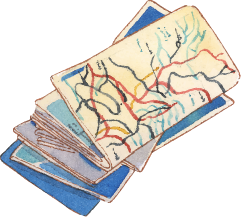
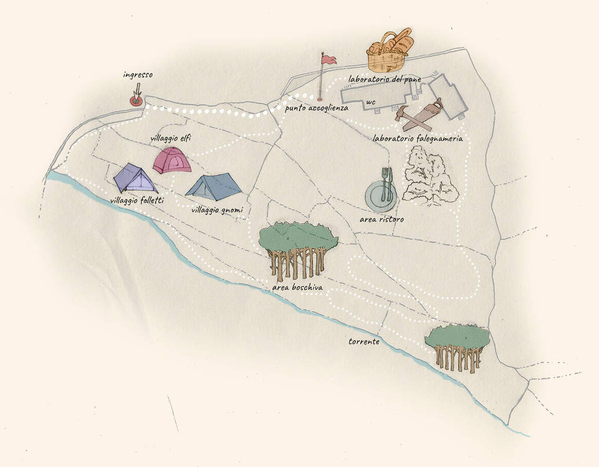
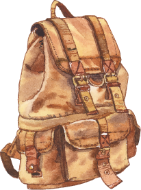
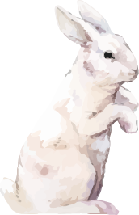
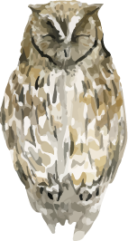
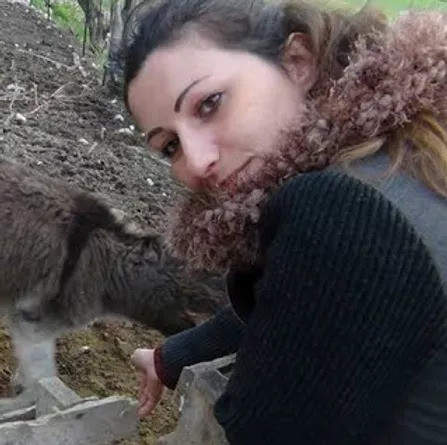
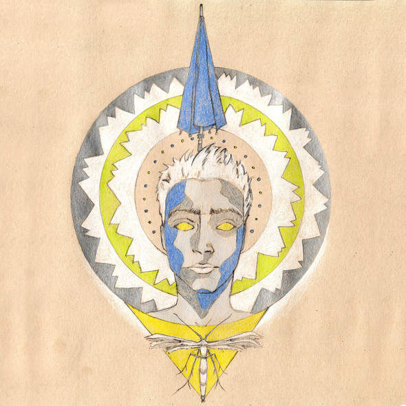
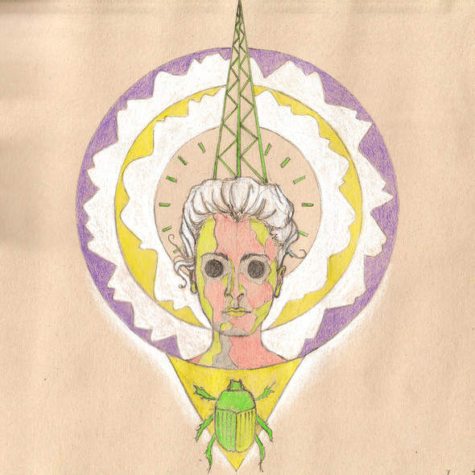

<Row $top={6} $bottom={6} $valign="center">
<Col md={6}>

</Col>
<Col md={6}>

<Toc $top={3} $bottom={3} title="Indice contenuti" items={toc}></Toc>

</Col>
</Row>

<Row id="campi-come-percorsi" $top={6}>
<Col>

### Campi come percorsi

</Col>
<Col md={7}>
<ReadMore lines={8}>

<var>A</var> LaSchola intendiamo i campi estivi come dei percorsi, sentieri che si snodano tra le querce, frutteti e prati che abitano questo posto incantato. Tracciati da seguire e abbandonare, scavalcare per poi riimboccare da un nuovo angolo e riscoprirli. Come piccole tappe del percorso più lungo, tortuoso e sorprendente che è la vita. Come dei fili che uniscono e mettono in relazione bambine e bambini, adolescenti, educatori e volontari che vogliono vivere questo luogo e sentirlo proprio, portarne con sé un pezzetto. E allora raccogliamo, disfiamo e ricuciamo insieme questi fili, che che come le venature dei tronchi vanno a stratificarsi nel profondo formando la complessità del sé. Pensiamo ai campi estivi come a delle mappe da esplorare e tracciare insieme, scoprendo i nomi delle cose e dandone di nuovi, risignificando ciò che troviamo alla luce delle relazioni che abbiamo intessuto tra di noi e con esse. Mappe sempre ancora sconosciute e allo stesso tempo familiari, dove sentirsi a casa ma scoprirsi ogni volta diversi. Così vogliamo vivere queste esperienze con i nostri piccoli ospiti, come esploratori di una cartina senza meta prestabilita, dove camminare insieme alla ricerca di ciò che ancora non conosciamo. Intendiamo mettere a disposizione un luogo accogliente dove arricchirsi di differenze e condividere sé stessi in modo libero e rispettoso con l'altro, dove esprimere le proprie inclinazioni, coltivare interessi e scoprirne di nuovi. Uno spazio dove costruire la propria autonomia attraverso il confronto e il dialogo, giocando e sporcandosi le mani. Dove vivere emozioni che si tramuteranno in ricordi, magari solo attraverso lo scambio di un sorriso dopo essersi riparati insieme dalla pioggia, raccogliendo fiori ancora intrisi d’acqua per farne un mazzetto da portare a casa.
Ci auguriamo che i nostri campi estivi rappresentino un momento di crescita e di confronto per tutti coloro che si lasceranno coinvolgere, **vi aspettiamo**!

</ReadMore>
<QuoteAuthor>

[Alessandro](#alessandro)

</QuoteAuthor>
</Col>
<Col md={5}>

</Col>
</Row>

<Row id="12-15" $top={6} $bottom={3} $valign="center">
<Col>
<SectionTitle>da 12 a 15 anni</SectionTitle>
<SectionSubtitle>Cronostoria di un pane fatto col fango</SectionSubtitle>
</Col>
<Col id="12-15-dettagli" md={5}>
<EntryInfo variant="frequency" label="30 luglio - 9 agosto" value="2020"/>
<EntryInfo variant="target" value="12-15 anni"/>
<EntryInfo variant="participants" value="7 - 21"/>
<EntryInfo variant="price" value="450 €"/>
<EntryInfo variant="teacher" label="Accompagnati" value="[dai nostri educatori e operatori](#personale)" $bottom={6}/>
<Footnote $bottom={3}>

La fascia d'età è da considerarsi flessibile a seconda del singolo caso e del gruppo che si formerà

</Footnote>
<Footnote>

Il costo totale di questo campo (10 giorni e 9 notti) è di 450 € per partecipante. Per fratelli e sorelle la quota è di 375 €. Il costo comprende tutto, dai pasti all'alloggio ai materiali per le attività comuni. È richiesto ai partecipanti di venire muniti di tenda e altro equipaggiamento base, vedi [cosa portare](#consigli)

</Footnote>
</Col>
<Col id="12-15-iscrizione" md={7}>

<h4>Iscrizioni entro il</h4>
<h3>25 luglio 2020</h3>

<Alert $top={3} color="orange">

[Scarica il modulo d'iscrizione](/documents/modulo-iscrizione-campo_estivo_2020--12-15_anni.pdf) da compilare in stampatello, firmare e inviare a [info@laschola.it](mailto:info@laschola.it)

</Alert>

</Col>
<Col id="12-15-programma">

<Footnote $top={3} $bottom={3} $align="center">

Di seguito il programma giorno per giorno

</Footnote>

<Schedule schedule={schedules.dodiciquindici}></Schedule>

<ButtonLink anchor="contattaci">Contattaci per informazioni</ButtonLink>

</Col>
</Row>

<Row id="6-11" $top={6} $bottom={3} $valign="center">
<Col>
<SectionTitle>da 6 a 11 anni</SectionTitle>
<SectionSubtitle>Il bosco magico ed altre storie</SectionSubtitle>
</Col>
<Col id="6-11-dettagli" md={5}>
<EntryInfo variant="frequency" label="20 - 30 agosto" value="2020"/>
<EntryInfo variant="target" value="6-11 anni"/>
<EntryInfo variant="participants" value="7 - 21"/>
<EntryInfo variant="price" value="450 €"/>
<EntryInfo variant="teacher" label="Accompagnati" value="[dai nostri educatori e operatori](#personale)" $bottom={6}/>
<Footnote $bottom={3}>

La fascia d'età è da considerarsi flessibile a seconda del singolo caso e del gruppo che si formerà

</Footnote>
<Footnote>

Il costo totale di questo campo (10 giorni e 9 notti) è di 450 € per partecipante. Per fratelli e sorelle la quota è di 375 €. Il costo comprende tutto, dai pasti all'alloggio ai materiali per le attività comuni. È richiesto ai partecipanti di venire muniti di tenda e altro equipaggiamento base, vedi [cosa portare](#consigli)

</Footnote>
</Col>
<Col id="6-11-dettagli" md={7}>
<h4>Iscrizioni entro il</h4>
<h3>15 agosto 2020</h3>

<Alert $top={3} color="green">

[Scarica il modulo d'iscrizione](/documents/modulo-iscrizione-campo_estivo_2020--6-11_anni.pdf) da compilare in stampatello, firmare e inviare a [info@laschola.it](mailto:info@laschola.it)

</Alert>

</Col>
<Col id="6-11-programma">

<Footnote $top={3} $bottom={3} $align="center">

Di seguito il programma giorno per giorno

</Footnote>

<Schedule schedule={schedules.seiundici}></Schedule>

<ButtonLink anchor="contattaci">Contattaci per informazioni</ButtonLink>

</Col>
<Col>

<Alert $top={6} color="lilla">

Al termine del secondo campo organizzeremo una giornata dove i partecipanti di entrambi i campi potranno tornare a LaSchola per conoscersi, condividere le proprie esperienze e mangiare insieme una pizza cotta nel **forno fatto col fango**

</Alert>

</Col>
</Row>

<Row id="iscrizione" $top={3} $bottom={6}>
<Col>
<SectionTitle>per entrambi i campi</SectionTitle>
<SectionSubtitle>Iscrizione e costi</SectionSubtitle>
</Col>
<Col $initial>

Scaricare il relativo modulo ([6-11 anni](/documents/modulo-iscrizione-campo_estivo_2020--6-11_anni.pdf), [12-15 anni](/documents/modulo-iscrizione-campo_estivo_2020--12-15_anni.pdf)) da compilare per ogni partecipante in tutte le sue parti e inviare a [info@laschola.it](mailto:info@laschola.it) accompagnato da attestazione di versamento dell’anticipo di `€ 70,00` sul C.C. dell’**Associazione Amici de LaSchola** – IBAN `IT 97 S 03069 09606 100000010755` – con causale **Contributo alle attività istituzionali - Campi Estivi 2020**. La restante parte della quota d'iscrizione dovrà essere versata all’arrivo, prima dell’inizio del campo.
La richiesta di iscrizione dovrà pervenire entro il giorno indicato sopra per ciascun campo tramite e-mail all’indirizzo [info@laschola.it](mailto:info@laschola.it) oppure potrà essere consegnata a mano presso la sede del campo.

</Col>
</Row>

<Row id="esperienza" $top={6}>
<Col>

### L’esperienza al campo

</Col>
<Col md={5}>

</Col>
<Col md={7} $initial>
<ReadMore lines={8}>

I nostri campi si vivono all’aperto, un’esperienza importante per lo sviluppo armonico dei giovani in cui si intensifica il rapporto tra l’individuo, la collettività e la natura. Si propongono come spazi di sperimentazione di un’ecologia complessa in cui il prendersi cura di sé comporta necessariamente la cura dell’altro e dell’ambiente circostante. Ci saranno escursioni, giochi, laboratori di manualità, attività di esplorazione, il tutto accompagnato dall'esperienza di dormire in tenda, di gestire un fuoco la sera, di preparare il pane, di autogestione del gruppo e dei conflitti che in esso inevitabilmente sorgeranno. Mescoleremo creatività, manipolazione, arte, sperimentazione e divertimento nella splendida cornice del parco de LaSchola.
I concetti base dei nostri campi sono stimolare l'espressione emotiva, il dialogo, risolvere i conflitti utilizzando il cerchio, favorire l'autoregolazione, l'autodeterminazione e l'indipendenza. Ci auguriamo quindi che saranno un momento di socializzazione in cui conoscere sé stessi un po’ più a fondo, per concedersi la fiducia nell’altro e la partecipazione alla vita in gruppo. I nostri piccoli ospiti saranno sempre guidati da educatori esperti, in grado di ascoltare con delicatezza le loro esigenze, e una particolare attenzione sarà dedicata alla loro alimentazione attraverso la preparazione di cibi sani e la scelta di materie prime attente ai criteri di sostenibilità.

</ReadMore>
</Col>
<Col id="mappa">

<QuoteAuthor>

Mappa degli spazi esterni nel [parco de Laschola](/spazi/parco) dedicati ai campi estivi.

</QuoteAuthor>
</Col>
</Row>

<Row id="filosofia" $top={6}>
<Col>

### La filosofia del campo

</Col>
<Col md={7} $initial>
<ReadMore lines={8}>

La nostra filosofia è che i campi sono uno spazio e un tempo a totale disposizione di bambini/e e ragazzi/e per essere, stare, sentire, scoprire, poter sbagliare, poter uscire da conflitti ed emozioni negative con una maggiore sicurezza interiore, in poche parole, poter creare una società migliore nel prossimo futuro.
Seguendo la nostra filosofia il campo estivo vuole essere punto d'incontro di realtà ed esperienze diverse, di avventura-scoperta, di gioco e fantasia, ma anche di creatività, espressione emotiva, apprendimento, socializzazione, contatto profondo con la natura che ci circonda. Fino ad ora ce l'abbiamo messa tutta prima di ogni altra cosa sforzandoci di rispettare i bisogni dei partecipanti, cercando di non lasciare niente di irrisolto, in sospeso, offrendo uno spazio, secondo i propri limiti, il più possibile adatto alla sperimentazione, alla conoscenza degli elementi naturali, al gioco, all'esperienza diretta, al confronto edificante tra coetanei e non.
Dall'altro lato ci interessa che anche i genitori trovino fiducia in noi cercando una comunicazione efficace, un riscontro continuo e una verifica dell'esperienza vissuta fermo restando che il campo estivo è e deve rimanere occasione per bambini/e e ragazzi/e di uscire ancora di più dalla sfera familiare, acquisire indipendenza, stabilire altre relazioni, ampliare gli orizzonti, sperimentarsi nel divertimento e nel disagio eventuale per uscire dall'esperienza con più capacità di autogestione.
Non proponiamo nessun pacchetto preconfezionato senza guardare in faccia chi partecipa, nessuna industria turistica e multinazionale dei campi avventura. Crediamo nell'unicità dell'esperienza che le personcine che ci vengono affidate potranno conservare tra i ricordi belli ed entusiasmanti dell'infanzia-adolescenza. Utilizzeremo il cerchio come strumento che permette di sviluppare la capacità di autogestione durante il campo permettendo espressione, proposte e risoluzione dei conflitti. Il cerchio attorno al fuoco è il simbolo della tribù temporanea, lo stimolo a stare in contatto con la realtà, con l'altro, con le proprie emozioni perché il fuoco è calore, è fulcro di uno stare con maggiore coscienza, è responsabilità, è protezione.

</ReadMore>
<QuoteAuthor>

Testo adattato dal [sito dell’associazione dei nostri educatori Angelica e Francesco](https://psicoecologica.wixsite.com/cres/campo-estivo-internazionale-6-11-an)

</QuoteAuthor>
</Col>
<Col md={5}>

</Col>
</Row>

<Row id="covid" $top={6}>
<Col>

### Misure COVID-19

</Col>
<Col md={6} $initial>

I nostri campi estivi saranno esclusivamente svolti all’aperto, ottemperando così il DPCM sull’emergenza Covid. Gli spazi al chiuso, qualora necessari, sono disposti e attrezzati in modo adeguato alle misure sanitarie in vigore.

</Col>
<Col md={6}>

<Alert>

I nostri campi estivi sono stati approvati dal comune di Casciago, potete [scaricare qui il progetto](/documents/progetto-organizzativo-campi_estivi_2020.pdf) a loro presentato dove trovate tutte le misure sanitarie previste.

</Alert>

</Col>
</Row>

<Row id="consigli" $top={6}>
<Col>
<SectionTitle>prepararsi al campo estivo</SectionTitle>
<SectionSubtitle>Consigli pratici</SectionSubtitle>
</Col>
<Col md={7}>

### Cosa portare al campo

Abbigliamento estivo, biancheria intima, maglioncino pesante, scarpe comode da trekking, calzette, mantella per pioggia, cappellino, borraccia, ciabattine per la doccia, asciugamani e/o accappatoio, spazzolino e dentifricio, sapone e altro occorrente per la trousse da bagno, costume da bagno, tenda da campeggio, sacco a pelo, materassino (meglio non gonfiabile perché può bucarsi), torcia, zainetto per escursione, piatto-bicchiere da pic-nic (no monouso) copia del tesserino sanitario, qualche euro da usare durante le uscite se i ragazzi/e volessero comprarsi un gelato o altro, strumenti musicali (se il bambin@-ragazz@ ha voglia di suonarli), giochi che siano condivisibili con il gruppo se si vuole, bussola (non strettamente necessaria), e infine sorrisi, gioia, motivazione e creatività. Si consiglia di organizzare l’abbigliamento con delle buste di plastica di modo da evitare il rischio che si sporchino o si bagnino prima di essere utilizzate. Fornire anche una busta dove mettere i panni sporchi.

</Col>
<Col md={5}>

### Cosa non portare

Per vari motivi vi chiediamo di non portare: cellulari, tablet, videogiochi e altre apparecchiature elettroniche che possono creare problemi o essere danneggiati, smarriti ecc. Forniremo noi il telefono ogni qual volta i bambini/e ed i ragazzi/e vogliano comunicare con i genitori.

</Col>
</Row>

<Row id="personale" $top={6} $valign="center">
<Col>
<SectionTitle>organizzato e gestito dagli</SectionTitle>
<SectionSubtitle>Educatori e operatori</SectionSubtitle>
</Col>
<Col sm={7}>

### Angelica

<Footnote $top={2}>
Educatrice e psicologa
</Footnote>

Madre di un bambino. Psicologa, psicoterapeuta cognitivo-comportamentale. Si è formata presso l'[Istituto Reich](https://www.istitutoreich.it) di Roma in Psicoterapia Breve Caratteroanalitica, e presso la la [Es.Te.R](https://www.esternet.org) di Valencia (Scuola Spagnola di Terapia Reichiana) in Ecologia dei Sistemi Umani con uno stage pratico presso il Centro Hazi-Hezi degli psicoterapeuti Cristina Aznar e Ramon Mauduit.

</Col>
<Col sm={5} orderxs={2}>
<ImgRounded>

</ImgRounded>
</Col>
<Col sm={5} orderxs={4}>
<ImgRounded>

</ImgRounded>
</Col>
<Col sm={7} orderxs={3} $top={6}>

### Francesco

<Footnote $top={2} $bottom={2}>
Educatore e responsabile laboratori pratici
</Footnote>

<ReadMore lines={8}>

Esperienza pluriennale nella gestione di attività socio-pedagogiche-formative con gruppi di bambini e di adulti. Si è formato presso l'[Istituto Reich](https://www.istitutoreich.it) in Interventi Brevi Psicocorporei, presso il Centro Eva Reich in Massaggio Bioenergetico Dolce e presso la [Es.Te.R.](https://www.esternet.org) (Scuola Spagnola di Terapia Reichiana) in Ecologia dei Sistemi Umani e Psicoterapia Breve Caratteroanalitica. Ha scritto vari articoli sull'importanza del contatto dopo la nascita e sull'educazione parentale ed ha curato il libro [*Nati in Casa, Le custodi della nascita raccontano*](https://www.ibs.it/nati-in-casa-custodi-della-libro-vari/e/9788895148069), Altica Edizioni. Ha tradotto vari saggi sull'assistenza orgonomica al parto e sull'allattamento scritti dall'ostetrico orgonomista inglese Peter Jones del quale ha curato e seguito vari seminari di formazione.

</ReadMore>
</Col>
<Col sm={7} orderxs={5} $top={6}>

### Alessandro

<Footnote $top={2} $bottom={2}>
Volontario educatore, organizzazione e logistica
</Footnote>
<ReadMore lines={8}>

Personalità eclettica Alessandro ama combinare gli interessi e le esperienze più svariate illudendosi che un giorno guardandosi indietro riconoscerà in esse una forma compiuta. Dopo studi artistici si laurea in Nuove Tecnologie per l'arte all'Accademia di Brera dove si incontra e scontra con il mondo della politica e dell'arte attraverso l'esperienza con il [collettivo AutArt](http://autart.org). Durante ed in seguito, portando avanti un'innata attitudine stakanovista incrociata con un profondo rifiuto del lavoro salariale, si adopera in bookshops, pizzerie, studi di grafica, tavoli di ristorante e quant'altro. Tra Milano, Verona e Amsterdam inizia a [costruire siti internet](https://kunderikuus.net) trovando una forma di lavoro adeguata alla sua necessità di libertà. Perseguendo un'irriducibile curiosità consegue una laurea al Goldsmiths College di Londra in Arte e Politica per poi tornare in Italia cercando di limitare la sua nomadicitá per avviare progetti comunitari di lungo respiro. Nel 2019 trova qui a LaSchola questa possibilità che affronta con profonda responsabilità e dedizione. Troppo poco modesto per non scriversi una biografia Alessandro adora l'ironia e combina una intenzionale laconicità con una solerte criticismo cercando sempre le parole giuste per trovare ciò che pensa sia sbagliato o soltanto per innescare e intessere una discussione. Lo troverete con un computer in mezzo a macchinari agricoli senza libretto d'istruzione.

</ReadMore>
</Col>
<Col sm={5} orderxs={6}>
<ImgRounded>

</ImgRounded>
</Col>
<Col sm={5} orderxs={8}>
<ImgRounded>

</ImgRounded>
</Col>
<Col sm={7} orderxs={7} $top={6}>

### Beatrice

<Footnote $top={2} $bottom={2}>
Chef, preparazione dei pasti e gestione cucina
</Footnote>
<ReadMore lines={8}>

Con uno spiccato senso pratico ed estetico Beatrice ha sempre dimostrato un interesse trasversale per l'espressione artistica in tutte le sue forme. Dopo il diploma al liceo artistico si è laureata in scenografia all'Accademia di Brera per poi tuffarsi immediatamente nel mondo della ristorazione seguendo la sua inclinazione naturale. Ha lavorato in numerose cucine dal Veneto al Piemonte alla Lombardia, cucinando in bettole, imbarcazioni e ristoranti stellati. Ancora giovanissima ha aperto un [proprio ristorante](https://www.facebook.com/ottocucina) dove poter portare avanti la sua idea di cucina. Dalla nascita della piccola Mila e perseguendo l'idea di uno stile di vita diverso ha deciso di abbandonare il mondo spesso troppo disumano della ristorazione. Nel 2019, cercando una vita meno frenetica e più improntata sulla condivisione lascia Milano e giunge qui a LaSchola offrendo le sue competenze in campo culinario, trovando lo spazio per approfondire e sperimentare l'orticoltura e la conoscenza di piante selvatiche. Proprio come una di esse si dimostra sempre tenace e in cerca di nuovi spazi da esplorare. Troppo modesta per scriversi una biografia Beatrice è un'amante della convivialità e combina un profondo e meticoloso interesse per la conoscenza con un'instancabile ricerca pratica. La troverete sempre con un progetto in mente e due nelle mani.

</ReadMore>
</Col>
</Row>

<FormContact id="contattaci" phoneable emailable subject="Campi estivi 2020" subtitle="Contattaci" title="per richiedere maggiori informazioni" msg="Ciao, vi scrivo riguardo ai campi estivi 2020..."></FormContact>

<QuoteAuthor $top={6}>

Le llustrazioni dello zaino, legna, coniglio, gufo, lanterna e cartina sono [disegnate da photographeeasia / Freepik](http://www.freepik.com), quelle del cielo, dell'albero e del sole sono [disegnate da Freepik](http://www.freepik.com)

</QuoteAuthor>
