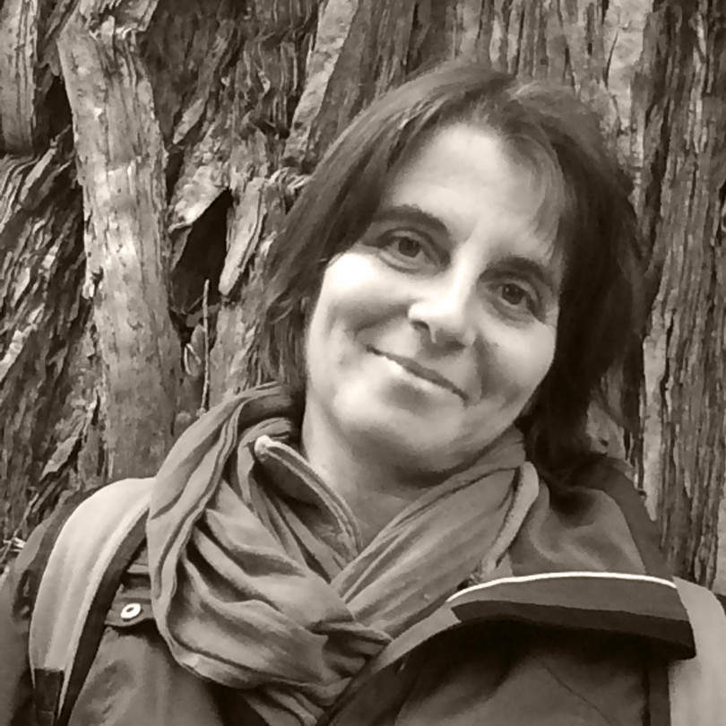

<Row top={6} bottom={3} alignItems="center">
<Col md={8}>
<EntryInfo variant="frequency" label="Quando" value="diviso in 4 moduli tra settembre e novembre 2020"/>
<EntryInfo variant="upcoming" label="1° modulo" value="[presso Pachamama il 9-10-11 ottobre](#logistica-1)"/>
<EntryInfo variant="upcoming" label="2°, 3° e 4° modulo" value="[presso LaSchola il 23-24-25 ottobre, 27-28-29 novembre, 4-5-6 dicembre](#logistica-2-3-4)"/>
<EntryInfo variant="price" value="520 € ([130 € a modulo, vedi dettagli](#iscrizione))"/>
<EntryInfo variant="teacher" value="[Elisabetta Dallavalle](#elisabetta-dallavalle) e [Francesca Simonetti](#francesca-simonetti)"/>
<EntryInfo variant="participants" value="tra i 12 e i 20"/>
</Col>
<Col md={4}>
<Alert bottom={3} color="green">

**Iscrizioni aperte!** [vedi dettagli](#iscrizione)

</Alert>
<Footnote>

Il corso partirà qualora verrà raggiunto il numero minimo di adesioni

</Footnote>
</Col>
</Row>

<Row top={6} bottom={3} alignItems="center">
<Col md={6} initial>

La **permacultura** è un metodo di progettazione per una vita sostenibile, fondata su principi etici ed ecologici con un approccio pratico alla vita quotidiana. Grazie alla sua impostazione multidisciplinare ed olistica, è in grado di offrire soluzioni e opportunità che permettono di affrontare in modo creativo la progettazione della nostra vita, del luogo in cui viviamo e delle persone che lo abitano.
In questo periodo storico, oltre alle problematiche legate al cambiamento climatico, alla semplificazione dei sistemi agro—forestali, alla riduzione della biodiversità e alla disgregazione socioeconomica, si sono aggiunte ulteriori difficoltà legate alla situazione sanitaria mondiale.
Emerge sempre di più l’importanza di rispondere positivamente a questi elementi esterni destabilizzanti, attraverso la consapevolezza, la visione e la progettazione della vita che vogliamo, lottando con la natura e non contro di essa, per creare sistemi sostenibili e resilienti.
Alla conclusione del corso di progettazione di 72 ore viene rilasciato un certificato di frequenza riconosciuto internazionalmente.

</Col>
<Col md={6}>

<Footnote>

Il corso è aperto a tutti e non sono richieste conoscenze specifiche.

</Footnote>
<BtnLink anchor="programma">Vedi il programma completo</BtnLink>
</Col>
</Row>

### Programma e modalità d'insegnamento

<Col columned>

L’interdisciplinarietà, l’approccio sistemico ed integrato della Permacultura, rendono questo corso unico, grazie al quale, si acquisisce la capacità di “saper guardare” al mondo che ci circonda con un approccio più olistico, sostenibile e resiliente.
Durante questo corso saranno trattati gli argomenti del corso di progettazione in Permacultura, pertanto, sarà seguito il curriculum formativo riconosciuto internazionalmente, con un particolare focus sugli aspetti legati alla creatività come risposta ai  momenti di crisi. 
Il metodo utilizzato sarà quello dell’apprendimento attivo, metodo in grado di acquisire la consapevolezza degli argomenti trattati, attraverso la mente, il corpo e le emozioni, favorendo, nello stesso tempo, lo sviluppo dell’osservazione e della creatività. Pertanto, le lezioni teoriche saranno alternate ad attività pratiche, dimostrative ed esperienziali.
Un altro obiettivo dei nostri corsi è quello di imparare a costruire un organismo (comunità), cioè un insieme di individui in grado di collaborare con sinergia, pieno rispetto e gratitudine nei confronti della diversità individuale, ottimizzando così la soluzione dei problemi. Verrà quindi continuamente stimolata la creazione di relazione fra i partecipanti, attraverso lavori di coppia, a piccoli gruppi ed in plenaria.

Gli argomenti trattati durante il corso di progettazione in permacultura sono i seguenti:

</Col>

<Col id="argomenti">

- Introduzione al corso
- La permacultura, cos'è? Storia, come e dove è nata.
- Etica della Permacultura
- I modelli della natura
- Osservazione dei modelli naturali
- Ecologia
- I Principi della Permacultura
- Attitudini nella Permacultura
- Spirali di distruzione e rigenerazione, conseguenze
- Metodi di progettazione
- I fattori della progettazione:
- Visibili
- Le forme di un territorio
- Clima
- Vegetazione
- Acqua
- Suolo e metodi di rigenerazione
- Invisibili 
- Sociali
- Economici – Economia etica
- Culturali
- I diversi ambienti:
- Zona 0 – La localizzazione della casa
- Zona 1 – Gli ambienti di pertinenza alla casa
- L'orto
- Il pollaio
- L'area giochi
- Gli spazi comuni
- Il parcheggio
- Zona 2 – Il frutteto e la food forest
- Zona 3 – La coltivazione delle colture erbacce annuali e perenni (cereali, foraggio, erbe officinali, ecc) il prato-pascolo e il pascolo
- Zona 4 – La gestione selvicolturale del bosco: funzione produttiva, protettiva, turistico-ricreativa, ecc…
- Zona 5 – Le aree a bassa o nulla gestione: le aree naturali
- Gestione della fauna selvatica e domestica
- Giardino e salute. Gestione integrata di patologie e parassiti
- Acquacoltura / acquaponica
- Permacultura in ambienti tropicali/desertici e montani
- Prevedere e affrontare il disastro
- La tecnologia adatta
- Permacultura in villaggi e comunità
- Bioregioni
- Soldi e benessere – sistemi alternativi (moneta locale, LETS, banca del tempo, ecc.)
- Soluzioni creative dei problemi
- Permacultura in ambiente urbano
- Progettazione pratica
- Attività pratiche varie: da definire

</Col>

<SectionTitle id="programma">Info programma</SectionTitle>
<SectionSubtitle>I 4 moduli</SectionSubtitle>

*I vari argomenti saranno sviluppati nei vari incontri come segue:*

<Row>
<Col id="modulo-1" md={6}>

### 1° Modulo

<EntryInfo top={3} variant="upcoming" label="9-10-11 ottobre 2020" value="dalle *9:30* di venerdì alle *18:00* di domenica"/>

- Permacultura: definizioni e ambiti
- Principi (etici, attitudinali, ecologici, di progettazione)
- Ecologia
- Spirali di distruzione e rigenerazione
- Osservazione dei modelli della natura
- Bioregione/Biodistretto
- Economia etica
- Ciclo progettuale, strategie e metodi di progettazione
- Progettazione focalizzata sulla creazione di una comunità resiliente, sostenibile e autosufficiente.

</Col>
<Col id="modulo-2" md={6}>

### 2° Modulo

<EntryInfo top={3} variant="upcoming" label="23-24-25 ottobre 2020" value="dalle *9:00* di venerdì alle *17:30* di domenica"/>

- Scala di permanenza
- Clima e microclima
- Le forme di un territorio - modello di terra e sua osservazione 
- Mappe, lettura del territorio e delle mappe
- Suolo e metodi di rigenerazione - movimenti terra
- Vegetazione
- Acqua (rurale, domestica, acquacoltura/acquaponica)

</Col>
<Col id="modulo-3" md={6}>

### 3° Modulo

<EntryInfo top={3} variant="upcoming" label="27-28-29 novembre 2020" value="dalle *9:00* di venerdì alle *17:30* di domenica"/>

- Produzione di cibo animale e vegetale e 
- Zona 0: l’abitazione 
- Zona 1 – Gli ambienti di pertinenza alla casa
- Zona 2 – Il frutteto e la food forest
- Zona 3 – Le colture erbacee annuali e perenni, il prato-pascolo e il pascolo
- Zona 4 – La gestione selvicolturale del bosco: funzione produttiva, protettiva, turistico-ricreativa, ecc…
- Zona 5 – Le aree a bassa o nulla gestione: le aree naturali
- Giardino e salute. Gestione integrata di patologie e parassiti
- Gestione della fauna selvatica e domestica
- Permacultura urbana
- Permacultura in ambienti tropicali/desertici e montani

</Col>
<Col id="modulo-4" md={6}>

### 4° Modulo

<EntryInfo top={3} variant="upcoming" label="4-5-6 dicembre 2020" value="dalle *9:00* di venerdì alle *17:30* di domenica"/>

- Venerdì: Approfondimenti - revisione argomenti - Interviste ai committenti - progettazione 
- Sabato e domenica: Progettazione in gruppo
- Domenica: presentazione progetti

</Col>
</Row>

<SectionTitle>con le insegnanti</SectionTitle>
<SectionSubtitle>Elisabetta Dallavalle e Francesca Simonetti</SectionSubtitle>

<Row top={6} bottom={3} alignItems="center">
<Col xm={9} sm={8} md={7}>

### Elisabetta Dallavalle

Ha conseguito la laurea in scienze agrarie e il dottorato di ricerca presso l’Università di Bologna, dove ha praticato attività scientifica e didattica nel settore della patologia vegetale e della micologia, per oltre vent’anni. Svolge la professione di agronomo libero professionista nella progettazione e nella divulgazione di sistemi ambientali sostenibili e si occupa, in collaborazione con Università ed Enti di ricerca, di sperimentazioni e ricerche in agricoltura biologica. E’ docente e progettista accreditata in Permacultura Applicata. Attualmente è presidente dell’[Accademia Italiana di Permacultura](https://www.permacultura.it/).

</Col>
<Col xm={3} sm={4} md={5}>
<ImgRounded>

</ImgRounded>
</Col>
</Row>

<Row top={6} bottom={3} alignItems="center">

<Col xm={3} sm={4} md={5} orderxs={2}>
<ImgRounded>

</ImgRounded>
</Col>
<Col xm={9} sm={8} md={7}>

### Francesca Simonetti

Agronoma e co-fondatrice di NatureDesigns, opera come libero professionista da più di venti anni nel settore agro-forestale e della sostenibilità ambientale per clienti privati ed enti pubblici. Dal 2008 ha integrato nella sua professione la Permacultura. Insegnante e progettista, acuta osservatrice ed amministratrice, Francesca ha abbinato i suoi interessi per gli aspetti sociali, spirituali e scientifici con la Permacultura. [greengaiaproject.org](http://greengaiaproject.org) - [naturedesignsjohnfranci.com](https://naturedesignsjohnfranci.com)

</Col>
</Row>

<SectionTitle id="iscrizione">Info corso</SectionTitle>
<SectionSubtitle>Costi e iscrizione</SectionSubtitle>

<Row top={6} bottom={3} alignItems="center">
<Col md={6}>
<EntryInfo bottom={6} variant="teacher" label="Corso" value="Il costo di iscrizione all'intero corso è di 520 € (130 € per modulo)."/>

### Iscrizioni aperte

<EntryInfo top={3} variant="upcoming" label="fino all'8 ottobre"/>
</Col>
<Col md={6}>
<Alert top={3} color="lightblue">

[Scarica il modulo di iscrizione](/documents/modulo-iscrizione-pdc-2020.pdf) da compilare in stampatello, firmare e inviare a [info@laschola.it](mailto:info@laschola.it)

</Alert>
<Footnote top={3}>

Il primo modulo non è necessario per coloro che l'hanno già seguito a LaSchola il [24-27 luglio 2020](/attività/corso-permacultura-come-progettare-creativamente-il-cambiamento) o in altra sede (in tal caso è necessario comunicarlo in anticipo) e utilizzare [questo modulo di iscrizione](/documents/modulo-iscrizione-pdc-2020-2_3_4.pdf)

</Footnote>
</Col>
</Row>

<SectionTitle id="logistica-1">Info logistica</SectionTitle>
<SectionSubtitle>1° modulo a Pachamama</SectionSubtitle>

<Row top={6} bottom={3} alignItems="center">
<Col id="costi-1" md={5}>
<EntryInfo variant="location" label="Dove" value="[via Pianzaghi 11 Massimo Visconti (NO) – Lago Maggiore](https://pachamamahome.it/come-arrivare/)"/>
<EntryInfo variant="upcoming" label="Quando" value="9-10-11 ottobre 2020"/>
<EntryInfo variant="duration" label="Orari" value="dalle *9:30* di venerdì alle *18:00* di domenica"/>
<EntryInfo variant="location" label="Pernottamento" value="30 € a notte (con lenzuola, salviette e cuscino inclusi), 22 € con (senza lenzuola, salviette e cuscino esclusi). Posto tenda propria: 5 €."/>
<EntryInfo variant="participants" label="Vitto" value="colazione 5€, pranzo 10€, cena 10€. Le merende sono incluse nei costi di pernottamento"/>
<EntryInfo variant="email" label="Info" value="+39 3356814718 - naturedesigns.franci@gmail.com"/>
<Footnote top={2}>
È necessaria la tessera associativa Pachamama Vergante: 5 €
</Footnote>
<BtnLink href="https://www.pachamamahome.it">Visita il sito di Pachamamama</BtnLink>
</Col>
<Col md={7}>

</Col>
</Row>

<BtnLink href="mailto:naturedesigns.franci@gmail.com">Scrivi a naturedesigns.franci@gmail.com per info e iscrizioni</BtnLink>

<SectionTitle id="logistica-2-3-4">Info logistica</SectionTitle>
<SectionSubtitle>2° 3° e 4° modulo a LaSchola</SectionSubtitle>

<Row top={6} bottom={3} alignItems="center">
<Col md={7}>

</Col>
<Col id="costi-2-3-4" md={5}>
<EntryInfo variant="location" label="Dove" value="[Via Maroni 13, Casciago 21020, VA](https://g.page/laschola?share)"/>
<EntryInfo variant="upcoming" label="Quando" value="2° modulo 23-24-25 ottobre, 3° modulo 27-28-29 novembre, 4° modulo 4-5-6 dicembre"/>
<EntryInfo variant="duration" label="Orari" value="dalle *9:00* di venerdì alle *17:30* di domenica"/>
<EntryInfo variant="location" label="Pernottamento" value="20 € a notte"/>
<EntryInfo variant="participants" label="Vitto" value="colazione 5€, pranzo 10€, cena 10€"/>
<Footnote top={2}>

Le merende sono incluse nei costi di pernottamento.
Per chi non si ferma a dormire è previsto un contributo di 10€ al giorno (merende incluse).

</Footnote>
<Footnote top={2}>

Le [camere da letto](/spazi/camere) sono triple con bagno in camera. È possibile richiedere una stanza singola previo accordo e disponibilità.

</Footnote>
</Col>
</Row>

<BtnLink anchor="contattaci">Contattaci per info e iscrizioni</BtnLink>

<ContactForm id="contattaci" emailable="info@laschola.it?subject=Corso di Progettazione in Permacultura" phoneable subtitle="Contattaci" title="per iscrizioni o per richiedere maggiori informazioni" message="Ciao, vi scrivo riguardo al 'Corso di Progettazione in Permacultura'..."></ContactForm>

<QuoteAuthor top={6}>

L'illustrazione delle coste è [disegnata da rawpixel.com / Freepik](http://www.freepik.com)

</QuoteAuthor>
