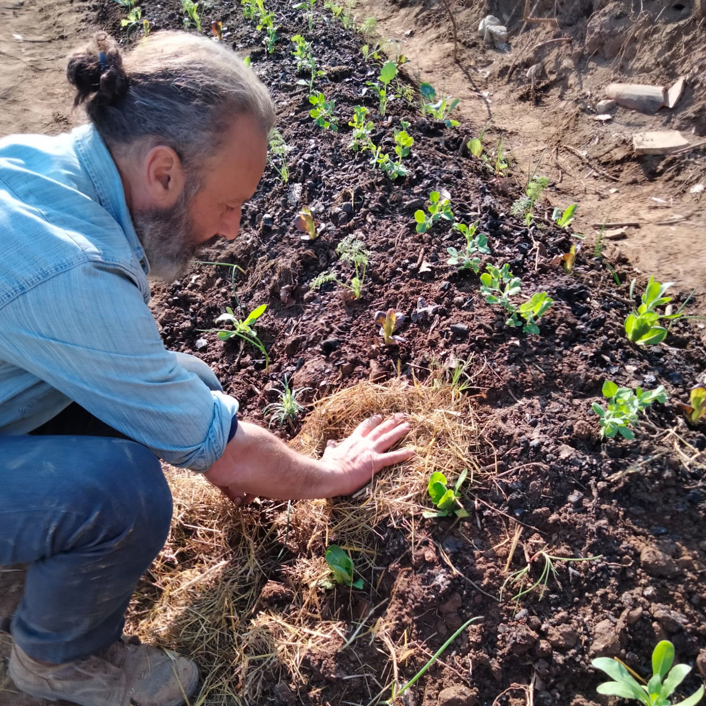

<Row $top={6} $bottom={3} $valign="center">
<Col md={7}>
  <EntryInfo variant="frequency" label="Quando" value="21 e 22 gennaio 2023"/>
  <EntryInfo variant="participants" value="massimo 25"/>
  <EntryInfo variant="price" value="70 € [vedi dettagli](#info)"/>
  <EntryInfo variant="teacher" value="[Marino Ricchiuti](#marino-ricchiuti)"/>
</Col>
  <Col md={5}>
    <Alert $bottom={3} color="green">
      **Iscrizioni aperte!** [vedi dettagli](#info)
    </Alert>
    <Footnote>
      Il corso partirà qualora verrà raggiunto il numero minimo di adesioni
    </Footnote>
  </Col>
</Row>
<Row $valign="center">
  <Col md={6} $initial>
    Due giorni nel mondo dei microrganismi per scoprirne la storia, gli utilizzi e il ruolo che giocano nelle nostre vite.

    Approfondiremo la relazione costituente che intessiamo con i microrganismi sperimentando pratiche e strumenti per divenire con essi soggetti attivi nella cura e rigenerazione del nostro pianeta.
    
    In questo corso alterneremo pratica e teoria producendo e attivando microrganismi attraverso varie tecniche, al termine ciascuno potrà portare a casa degli EM per continuare la rigenerazione.

    <Footnote>
      Il corso è aperto a tutti e non sono richieste conoscenze specifiche.
    </Footnote>
  </Col>
  <Col md={6}>
    
  </Col>
</Row>

<Row $top={6} $bottom={3} $valign="center">
  <Col xm={3} sm={4} md={5} orderxs={2}>
    <ImgRounded>
      
    </ImgRounded>
  </Col>
  <Col xm={9} sm={8} md={7}>
    ### Marino Ricchiuti

    Nasco a Milano il 28/06/1966. Sono diventato progettista grafico lavorando a lungo nel settore editoriale, ma la passione per la natura e la vita di campagna mi ha spinto a trasferirmi tra i laghi del varesotto giovanissimo. Dopo qualche tempo apro una ditta di giardinaggio, proprio per stare il più possibile nel verde. Facendo esperienza nella gestione di parchi e giardini e approfondendo le tematiche di rigenerazione del suolo oggi così fondamentali, ho conosciuto la tecnologia dei microorganismi effettivi del professor Higa. La grande potenzialità rigenerativa per l'ambiente, la salute e la società di questa preziosa miscela mi ha presto affascinato. Oggi mi definisco un ricercatore e un divulgatore della tecnologia em. Grazie alle molteplici esperienze nei diversi settori dall'agricoltura rigenerativa alla cosmesi, propongo soluzioni ecosostenibili e rigenerative alla portata di tutti per qualsiasi tipo di attività. Convinto di essere tutti parte di un unico organismo, mi sforzo il più possibile di esserne una sua cellula rigenerativa per preservare la bellezza di questo pianeta e soprattutto restare connesso con una dimensione umana.
  </Col>
</Row>

<SectionTitle id="info">Informazioni</SectionTitle>
<SectionSubtitle>Iscrizioni, costi e logistica</SectionSubtitle>

<Row $top={6} $bottom={3} $valign="center">
  <Col md={6}>
    <EntryInfo variant="price" label="Costo" value="L'iscrizione è di 70 € (da versare anticipatamente)"/>
    <EntryInfo variant="location" label="Dove" value="presso LaSchola [Via Maroni 13, Casciago 21020, VA](https://g.page/laschola?share)"/>
    <EntryInfo variant="duration" label="Orari" value="dalle *9:00* alle *17:00* circa con pausa pranzo"/>
    <EntryInfo variant="target" label="Possibilità di pernottamento" value="20 € a notte a persona*"/>
    <Footnote $top={2}>
      *Ci sono 5 camere per un totale di 17 posti letto, le [camere da letto](/spazi/camere) sono triple o quadruple con bagno. Abbiamo coperte e cuscini ma non forniamo biancheria. È possibile richiedere una stanza singola previo accordo e disponibilità.

      A fine soggiorno sono richiesti 10 € per camera per le pulizie da dividere tra gli occupanti della stessa.
    </Footnote>
    <EntryInfo $top={4} variant="target" label="Pasti" value="pranzi di sabato e domenica"/>
    Per il pranzo di sabato ognuno porterà qualcosa da casa e condivideremo il pasto, domenica mangeremo invece prodotti coltivati con EM portati da Marino.
  </Col>
  <Col md={6}>

    ### Iscrizioni aperte

    <EntryInfo $top={3} variant="upcoming" label="fino al 15 gennaio 2023"/>
    
    <Alert $top={3} color="lightblue">

    [Scarica il modulo](https://github.com/amicidellaschola/content-www/raw/main/events/2023-01-22--microrganismi-effettivi/modulo-iscrizione-microrganismi-2023.pdf) da compilare in stampatello, firmare e inviare a [amicidellaschola@gmail.com](mailto:amicidellaschola@gmail.com)

    </Alert>
  </Col>
</Row>

<FormContact id="contattaci" phoneable emailable subject="Microrganismi effettivi" subtitle="Contattaci" title="per iscrizioni o per richiedere maggiori informazioni" msg="Ciao, vi scrivo riguardo al corso 'Microrganismi effettivi'..." />
