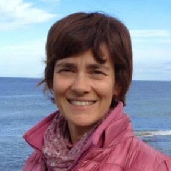

<Row>
  <Col md={7}>
    <EntryInfo variant="frequency" label="Quando" value="22 ottobre 2023"/>
    <EntryInfo variant="duration" label="Orario" value="dalle 20 alle 23"/>
    <EntryInfo variant="price" value="50 €"/>
    <EntryInfo variant="participants" value="massimo 16"/>
    <EntryInfo variant="location" label="A LaSchola" value="[Via Maroni 13, Casciago 21020, VA](https://g.page/laschola?share) raggiungibile con auto o treno da Milano"/>
    <EntryInfo variant="teacher" label="Condotta da" value="[Laura Pasetti](#laura-pasetti), [Theatre of the 7 Directions](https://theatreofthe7directions.com/)" />
    <EntryInfo variant="web" label="Visita" value="[theatreofthe7directions.com](https://theatreofthe7directions.com/)" $bottom={3} />
  </Col>
  <Col md={5}>
    <Alert color="pink">
      **Workshop per educatori**
      
      Per informazioni e prenotazioni scrivere a
    </Alert>

    <ButtonLink href="mailto:theatreofthe7d@gmail.com">theatreofthe7d@gmail.com</ButtonLink>
  </Col>
</Row>

<Row $top={3}>
  <Col $columned $initial>
    Siamo pronti ad essere protagonisti della nostra vita? O lasciamo che sia la famiglia, la società, la cultura in cui siamo cresciuti ad assegnarci un ruolo?

    Quante volte in una settimana possiamo dire “oggi sono veramente felice” e come la usiamo questa felicità? Cosa ne facciamo?

    Siamo capaci di imbottigliarla perchè ci possa venire utile in altri momenti? Siamo pronti ad essere responsabili della nostra felicità?

    In questa giornata parleremo di cosa significa essere protagonisti, del coraggio che ci vuole e delle paure che ce lo impediscono. Proveremo a considerare il coraggio come la capacità di arrendersi e lasciare andare e la paura come un alleato.

    Diventare protagonisti significa diventare adulti e noi educatori come possiamo insegnare ad altri a diventare adulti se non lo siamo prima di tutto noi stessi?
  </Col>
</Row>

<Row $top={6}>
  <Col md={2}></Col>
  <Col xs={3} md={2}>
    <ImgRounded>
      
    </ImgRounded>
  </Col>
  <Col xs={9} md={6} id="laura-pasetti">
    ### Laura Pasetti
    
    Formata con Giorgio Strehler al Piccolo Teatro di Milano, dove ha insegnato per 10 anni, si è specializzata in spettacoli e laboratori per adolescenti.
    Dopo 30 anni nel campo teatrale, ha completato un training di un anno sulle pratiche basate in natura in Catalogna e approfondito l’utilizzo dell’arte nella formazione e nel percorso educativo. Ha una laurea magistrale (MA) in Engaged Ecology.
    Ha fondato [Theatre of the 7 Directions](https://theatreofthe7directions.com/) per offrire percorsi alternativi di crescita e di recupero del senso di appartenenza.
  </Col>
</Row>
