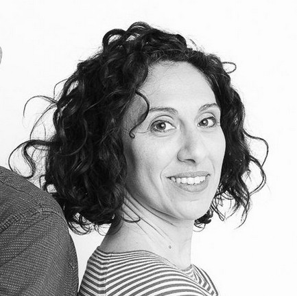

<Row>
  <Col md={5}>
    <EntryInfo variant="location" label="A LaSchola" value="[Via Maroni 13, Casciago 21020, VA](https://g.page/laschola?share)"/>
    <EntryInfo variant="frequency" label="Quando" value="domenica 16 giugno 2024"/>
    <EntryInfo variant="duration" label="Orario" value="dalle 15:00 alle 17:00"/>
    <EntryInfo variant="price" label="Contributo" value="25 € a persona, materiali inclusi"/>
    <EntryInfo variant="teacher" label="Condotto da" value="arch. [Claudia Risi](#claudia-risi)"/>
    <EntryInfo variant="phone" label="Telefono" value="[328 248 7320](tel:+393282487320)"/>
  </Col>
  <Col md={7}>

    > Riconosci la tua Stanza nel Cuore e impara ad ascoltare come gli ambienti comunicano con il tuo mondo interno.
  </Col>
<Row>
  <Col md={6}>
    Cosa significa Abitare una stanza? Una casa? Una città? Cosa significa Abitare il mondo?

    Questo laboratorio esperienziale è il primo passo per aprire uno spazio di ascolto: come comunicano i luoghi con il mio mondo interno? Quale linguaggio utilizzano e come posso aprire uno spazio di relazione?
    
    Viaggeremo dentro di noi per scoprire ciò che ci fa stare bene fuori e realizzeremo una Vision Board per avere uno strumento guida sempre a nostra disposizione.

    Questo laboratorio da per te se vuoi riconoscere ciò che risuona con il tuo Cuore ed avere uno strumento per cominciare a guardare con occhi nuovi i luoghi in cui vivi.

    <QuoteAuthor>
      arch. Claudia Risi
    </QuoteAuthor>

    Per info e prenotazioni:

    <ButtonLink href="tel:+393282487320">WhatsApp 328 248 7320</ButtonLink>
  </Col>
  <Col md={6}>
    Per tutti i genitori e le famiglie, abbiamo organizzato nelle stesse ore anche un laboratorio con merenda "ChiAma la Natura" per bambini 3-9 anni condotto da Cristina.

    > Spargiamo semi per dare vita a nuovi mondi. Vieni a scoprire come si creano le palline di argilla e semi.

    <EntryInfo variant="duration" label="Durata" value="120 minuti"/>
    <EntryInfo variant="price" label="Contributo" value="25 € a persona, materiali inclusi"/>
    <EntryInfo variant="price" label="Pacchetto famiglia" value="30 €/1 adulto+1 bambino/a, materiali e merenda inclusi"/>
    <EntryInfo variant="price" label="Dal secondo figlio" value="10 €/bambino/a, materiali e merenda inclusi"/>
  </Col>
</Row>

<Row>
  <Col id="contattaci">
    <SectionTitle>per info e prenotazioni</SectionTitle>
    <SectionSubtitle>contatta</SectionSubtitle>
  </Col>
  <Col md={2}></Col>
  <Col xs={3} md={2}>
    <ImgRounded>
      
    </ImgRounded>
  </Col>
  <Col xs={9} md={6}>
    ### Claudia Risi

    Sono Claudia e ho messo le mie radici a Varese. Laureata in Architettura nel 2008, ho maturato il mio lavoro nell'ambito delle installazioni site-specific.

    Da sempre indago le relazioni Corpo-Spazio, Natura-Artificio attraverso differenti discipline tecniche, artistiche ed energetiche.

    Oggi condivido la mia esperienzia con laboratori e percorsi di formazione per permettere alle persone di portare con consapevolezza l'armonia e il benessere nei luoghi in cui vivono.

    Nel 2017, con il mio compagno di vita, abbiamo fondato Bìu Lab, spazio artigianale di ricerca e co-creazione. Reallizamo geometrie energetiche sia come installazioni in luoghi pubblici che come oggetti per uso personale.

    <EntryInfo variant="web" label="Instagram" value="[instagram.com/biu.lab](https://www.instagram.com/biu.lab/)"/>
    <EntryInfo variant="web" label="Facebook" value="[facebook.com/infobiu](https://www.facebook.com/infobiu/)"/>
    <EntryInfo variant="phone" label="Telefono" value="[328 248 7320](tel:+393282487320)" $bottom={1}/>
  </Col>
</Row>
