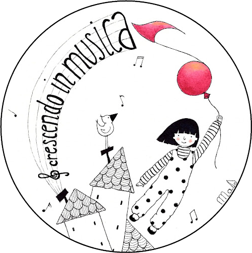

<EntryInfo variant="frequency" label="Quando" value="dal 14 al 20 luglio 2024"/>
<EntryInfo variant="target" label="fascia d'età" value="6 - 16 anni"/>
<EntryInfo variant="location" label="A LaSchola" value="[Via Maroni 13, Casciago 21020, VA](https://g.page/laschola?share)"/>
<EntryInfo variant="teacher" label="Organizzato da" value="[Crescendo in musica](http://www.musicaperbambini.eu/mpb/home/crescendo-in-musica/)" />
<EntryInfo variant="email" label="Email" value="[crescendoinmusica2021@gmail.com](mailto:crescendoinmusica2021@gmail.com)" $bottom={1}/>
<EntryInfo variant="phone" label="Telefono" value="[327 4367354](tel:3274367354) / [340 5998378](tel:3405998378)"/>

<Row $top={6}>
  <Col $narrow $initial>
    Campus per bambini e ragazzi dai 6 ai 16 anni per vivere il connubio tra musica, teatro e natura, ritrovando il piacere di vivere l’empatia con la natura in una comunità artistica.
  </Col>
</Row>

<Row $top={6} $valign="center">
  <Col md={1}></Col>
  <Col xs={5} md={4}>
    <ImgRounded>
      
    </ImgRounded>
    <QuoteAuthor>
      [Crescendo in musica](http://www.musicaperbambini.eu/mpb/home/crescendo-in-musica/)
    </QuoteAuthor>
  </Col>
  <Col xs={7} md={6}>
    > “Il colore è un mezzo per esercitare un influsso diretto sull'Anima. Il colore è il tasto. L'occhio è il martelletto. L'Anima è un pianoforte con molte corde. L'artista è la mano che con questo o quel tasto porta l'anima a vibrare.”
    <QuoteAuthor>
      Wassily Kandinsky
    </QuoteAuthor>
  </Col>
</Row>
