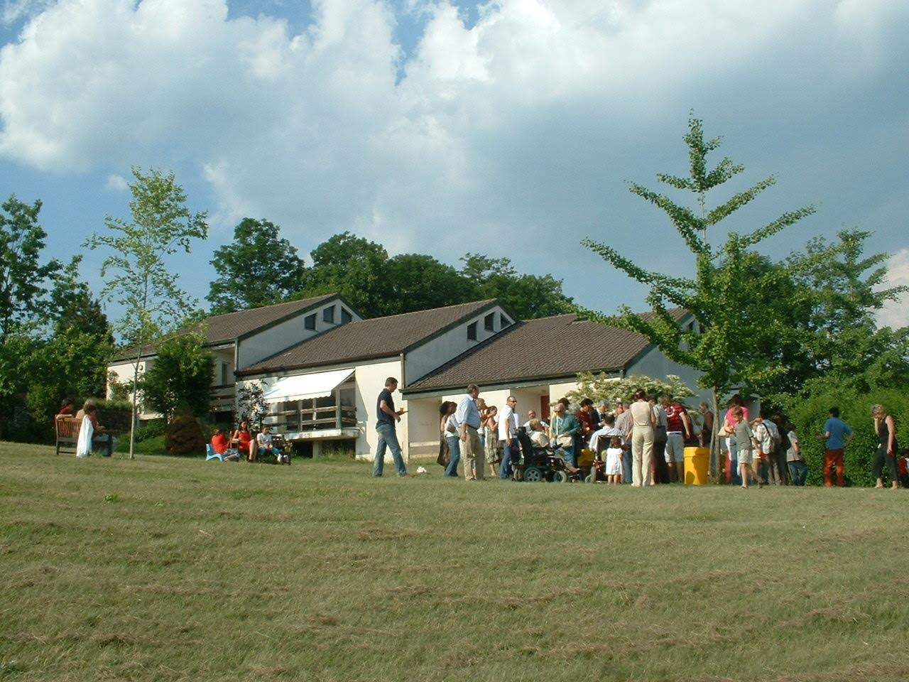

<Row>
<Col $initial $columned>

LaSchola è stata, fino a quindici anni fa, un luogo di sperimentazione di vita autonoma e comunitaria per adolescenti provenienti da tutta Italia. Un collegio dove i ragazzi vivevano al di fuori degli orari scolastici imparando a gestire le mansioni della vita quotidiana e cimentandosi in varie attività culturali, ludiche e di ricerca, dal teatro all'orticultura, dallo sport allo studio.

All'inizio degli anni 2000 gli iscritti erano troppo pochi per continuare e da quel momento LaSchola ha ospitato per qualche tempo le attività di ricerca e i seminari dell'associazione [Centro Coscienza](/partners/centro-coscienza/) per poi chiudere nel 2015 per quattro anni.

Oggi, dopo la riapertura del 2019, continua la presenza e l'attività di [Centro Coscienza](/partners/centro-coscienza/) con il sostegno dell'associazione di volontariato [Amici de LaSchola](/partners/amici-de-laschola/) e una crescente volontà di aprirsi alla comunità e di infittire la rete di collaborazione con le realtà del territorio.

L'obiettivo è di riattivare e ampliare le potenzialità dei laboratori una volta esistenti aprendone l’accesso a una comunità più ampia cercando così di favorire un conviviale scambio di saperi ed esperienze tra gli abitanti. Il confronto con le realtà locali ha reso evidente una forte necessità comune di spazi e momenti dove bambini e adolescenti possano sperimentare attraverso attività pratiche momenti di socialità che mettano in gioco le loro capacità creative e tensioni espressive.

Da qui l’idea di aprire dei laboratori e organizzare corsi come luoghi e tempi per un’educazione libera e giocosa che parta dai loro desideri. Laboratori e attività che permettano a bambini e ragazze di “imparare facendo”, di apprendere conoscenze e sviluppare abilità manuali che sembrano sempre più mere appendici nostalgiche in un mondo governato da bit e alimentato da monocolture OGM. Abilità che al contrario costituiscono le basi di una vita autonoma e consapevole, di un rapporto più potente e profondo con la materia del mondo.

</Col>
</Row>