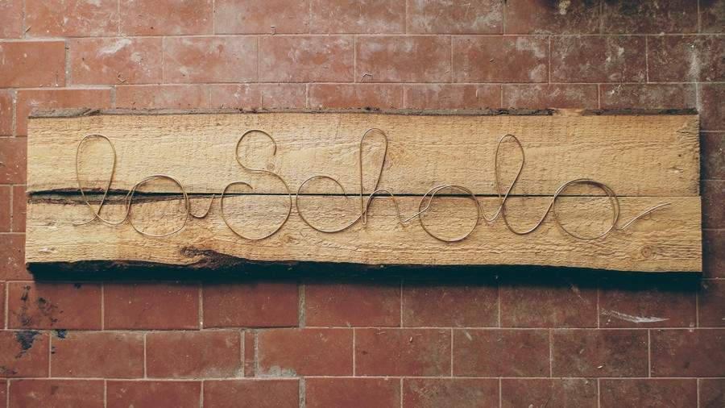
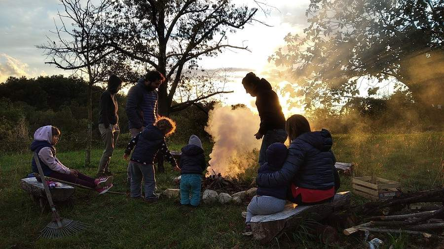
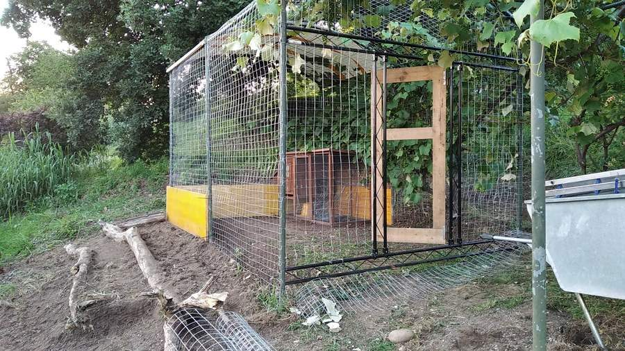

import { Toc } from "src/components/Toc";
import { PageDivider } from "src/core/Page";
import { CarouselMdx } from "src/core/Carousel";
import { VisionLoadable as Vision } from "src/components/Custom";

<Toc top={3} bottom={3} title="Contenuti" list={{
  "Visione": "#visione",
  "Le tre etiche": "#etiche",
  "Cura della terra": "#cura-della-terra",
  "Cura delle persone": "#cura-delle-persone",
  "Distribuzione equa": "#distribuzione-equa",
  "Analisi SWOT": "#analisi-swot",
  "Analisi settori": "#analisi-settori",
  "Analisi territorio": "#analisi-territorio",
  "Analisi sociale": "#analisi-sociale",
  "Analisi zone": "#analisi-zone",
  "Principi di permacultura": "#principi"
}} />

<CarouselMdx autoWidth={true} autoHeight={true}>

</CarouselMdx>

<SectionTitle id="visione">quello che vorremmo realizzare</SectionTitle>
<SectionSubtitle>La visione</SectionSubtitle>
<Vision></Vision>

<PageDivider />

<SectionTitle id="etiche">Cosa significano per noi e come applicarle</SectionTitle>
<SectionSubtitle>Le tre etiche</SectionSubtitle>

<Row alignItems="center">
<Col md={7}>

### Cura della terra

#### Cosa significa per noi

Per noi significa ecosostenibilità, nella nostra vita quotidiana possiamo metterla in atto attraverso semplici azioni:

- Consumare in modo consapevole
- Ridurre drasticamente la produzione di rifiuti inorganici.
- Acquistare prodotti sfusi
- Acquistare attraverso il GAS da cui già ci forniamo
- Autoprodurre i saponi sarebbe semplice e efficace.
- Considerare il terreno attorno a noi come un essere da vivente da conoscere, osservare e di cui prendersi cura; al quale dare e da cui ricevere. Costruire con la terra un rapporto di amicizia duraturo per far sì che da entrambe le parti si possa ottenere il meglio e prevedere il peggio, senza distruggere la relazione.

</Col>
<Col md={5}>

#### Nel nostro progetto

- orto condiviso, frutteto e cura del verde con particolare attenzione alla biodiversità presente
- animali (capre, galline, fattoria didattica)
- efficienza energetica
- recupero delle acque
- riciclo e riuso

</Col>
</Row>

<Row alignItems="center" top={4}>
<Col md={7}>

### Cura delle persone

#### Cosa significa per noi

Non è tanto riguardo al _cosa_ fare ma al _come_ farlo, per noi significa:

- Avere **cura di sé** stessi in quanto è l’unica cosa che possiamo cambiare
- Ricercare i propri **desideri** e soddisfazione sia a livello individuale che **collettivo** (fare lavori in gruppo dà più soddisfazione).
- Concedersi il tempo di conoscere sé stessi, capire i propri bisogni e praticare attività volte al **benessere della persona**
- Concedersi la possibilità di appassionarsi e perseguire intensamente una via o un progetto ma anche di **abbandonarlo** strada facendo se lo si trova non soddisfacente o piacevole. È necessario comunque mantenere la **progettualità** per evitare gli sprechi di energie e risorse (principio strumentale di Mollison_ **Massimizzare l’energia**_ e di Holmgren **_Non produrre rifiuti_**… nel senso che da ogni esperienza, anche se fallimentare, si può trarre qualcosa).

<QuoteAuthor top={1}>Cerchio durante corso di Permacultura</QuoteAuthor>
</Col>
<Col md={5}>

- Darsi i tempi necessari senza incorrere nel senso di **urgenza** (come autoprodurre senza replicare logiche del mondo del lavoro capitalista?)
- Rispetto dei propri **tempi e ritmi personali** accettando quelli degli altri **senza aspettative**
- Vivere in un luogo con una buona **qualità ambientale**
- Assumere uno **sguardo privo di giudizio**, aperto e tollerante verso l’altro
- Essere **accoglienti, generosi** e limitare il senso di proprietà privata
- Ricercare metodi di **partecipazione collettiva**
- Coltivare le **relazioni** e la **curiosità verso l'altro**
- Portare avanti un **atteggiamento inclusivo** e non esclusivo volto però alla costruzione di un pensiero comune sulle cose
- **Rispetto delle diversità** e attenzione alle peculiarità di ciascuno
- **Comunicare in modo trasparente**, creare un contenitore, uno spazio-tempo dove poter ridefinire i propri ruoli e desideri mutevoli nel tempo.
- Dedicare uno spazio-tempo di **riflessione e approfondimento culturale**, sia individuale che collettivo.
- Vivere in **condivisione** di beni, pensieri, saperi e azioni ma con **spazio alla libertà **personale

</Col>
<Col md={5}>

#### Nel nostro progetto

- Attività laboratoriali di varia natura in cui imparare, imparare facendo e far circolare i saperi
- aumento degli spazi destinati ad abitazioni
- creazione di momenti “ strutturati” di ascolto e scambio tra le persone
- ospitalità sociale, scambio ospitalità-lavoro
- attività con gli enti di formazione del territorio (scuole, associazioni, gruppi, singoli, ecc.)

</Col>
<Col md={7}>

<QuoteAuthor top={1}>Area falò</QuoteAuthor>
</Col>
</Row>

<Row alignItems="center" top={4}>
<Col md={5}>

### Distribuzione equa

<QuoteAuthor top={1}>Dall'orto dei vicini è più saporito</QuoteAuthor>
</Col>
<Col md={7}>

#### Cosa significa per noi

- **Condividere i saperi**, idea del maestro ignorante e dell’imparare insegnando.
- essere disponibili all’altro, praticare il **mutuo soccorso**
- **Non basarsi su unità astratte** e numeriche di parità (1 ≠ 1), gestire i tempi e le modalità di lavoro non su orari fissi uguali per tutti ma sull’inclinazione e autovalutazione personale e collettiva
- **Decentrare il punto di vista**, accogliere la presenza della collettività come parte integrante della propria visione. Disseminare sé stessi ridistribuendo le proprie energie in progetti non solo individuali.
- **Dividere compiti e responsabilità**, ma anche garantire (senza obbligare) la **rotazione dei ruoli**, di sperimentarsi in attività diverse senza inseguire l’efficienza o la coerenza assoluta.

#### Nel nostro progetto

- laboratori aperti, libero accesso agli spazi attrezzati
- condivisione degli spazi
- reti con il territorio (produttori locali di saperi e beni)

</Col>
</Row>

<Row alignItems="center" top={4}>
<Col md={2}>
</Col>
<Col md={8}>

### Le tre etiche nella nostra vita

- mi sentirei meglio con me stesso/a, sarei più **felice**
- sentirei di **fare qualcosa di utile per il **mio** futuro** e per quello degli altri
- sarei **meno vincolato al denaro per raggiungere il benessere** ma sarei più **ricco/a di esperienze/conoscenza**
- avrei **relazioni più profonde con le persone** in virtù della vicinanza e condivisione di esperienze quotidiane
- sentirei **meno** la **solitudine** e più leggera/o
- i miei **figli** starebbero meglio (avrebbero più spazio in cui giocare, sarebbero più consapevoli del mondo vivente che li circonda e avrebbero più rispetto di esso, avrebbero la possibilità di crescere a stretto contatto con adulti differenti e di confrontarsi maggiormente con i loro limiti..)
- avrei **meno cose inutili**
- spererei di aver così più **possibilità di scegliere** quello che davvero mi interessa

</Col>
</Row>

<PageDivider />

<SectionTitle id="analisi-swot">osservazione e analisi del sito</SectionTitle>
<SectionSubtitle>Analisi SWOT</SectionSubtitle>
<Row alignItems="center">
<Col md={2}>

### Interno

</Col>
<Col md={5}>

### Positivo

#### Punti di forza
- Acqua
- Natura (buona esposizione, biodiversità, poco inquinamento)
- Morfologia
- Comunità Il Pezzettino
- Bellezza (valore paesaggistico)
- Supporto economico (fondazione)
- Diverse generazioni al lavoro con competenze diverse
- Nuove vite in arrivo
- Struttura degli edifici in buono stato con disponibilità di strumenti e materiali

</Col>
<Col md={5}>

### Negativo

#### Punti di debolezza
- Necessità di strumenti di "gestione" collettiva (cerchi, assemblee, etc.)
- Pochi spazi ad uso abitativo -> pochi abitanti
- Diversi interlocutori
- Elevato spazio da gestire e discreto capitale umano a disposizione
- Poca visiblità (insegna e indicazioni lungo la strada)
- Eredità storica significative (come partire da lì senza ancorarvisi)
- Struttura da cui dipendere (non completa libertà di scelta)

</Col>
</Row>
<Row>
<Col md={2}>

### Esterno

</Col>
<Col md={5}>

#### Opportunità
- Vicini
- Collegamenti con Milano e Varese (treno e auto)
- Realizzazione di un polo/punto di riferimento sociale e culturale
- Accoglienza abitativa
- Reti con produttori locali e associazioni
- Lago
- Montagne
- Nuova fattoria didattica

</Col>
<Col md={5}>

#### Minacce
- Ampia offerta formativa
- Burocrazia e costi (es: cambio d'uso degli spazi)
- Predatori (animali selvatici)
- Covid19 (possibile nuovo isolamento)
- Cura aree perimetrali (strada/spazzatura)
- Eventi meteorici abbondanti
- Cultura e politiche del territorio

</Col>
</Row>

<PageDivider />

<SectionTitle id="analisi-settori">osservazione e analisi del sito</SectionTitle>
<SectionSubtitle>Analisi settori</SectionSubtitle>
<Row>
<Col>

</Col>
</Row>

<PageDivider />

<SectionTitle id="analisi-ambientale">osservazione e analisi del sito</SectionTitle>
<SectionSubtitle>Analisi ambientale</SectionSubtitle>
<Row alignItems="center">
<Col md={6}>

### Temperatura

- 3/4 mesi di stagione fredda con Tmax &lt; 10C°
- 3 mesi di stagione calda con Tmax > 23C°
- Da metà dicembre a metà febbraio Temp notturne &lt; 0°

</Col>
<Col md={6}>

<QuoteAuthor top={1}>Temperatura massima e minima media</QuoteAuthor>

</Col>
<Col md={6}>

<QuoteAuthor top={1}>Precipitazioni mensili medie</QuoteAuthor>

</Col>
<Col md={6}>

### Precipitazioni

- 3 mesi di piovosità scarsa (&lt; 50 litri ogni mq al mese)
- 1 mese con piovosità elevata (>100 litri ogni mq)
- Siccità > 30 gg (gg consecutivi senza piogge)

</Col>
<Col md={6}>

### Vento

- Velocità media circa 7 km/h (a 10 m dal suolo)
- 9 mesi direzione prevalente di provenienza N (a 10 m dal suolo)
- 3 mesi direzione prevalente di provenienza S (a 10 m dal suolo)

</Col>
<Col md={6}>

<QuoteAuthor top={1}>Velocità media del vento</QuoteAuthor>

</Col>
<Col md={6}>

</Col>
<Col md={6}>

### Suolo

- 10 cm topsoil e 150 cm di limo argilloso sabbioso (Analisi stratigrafica in situ)
- Permeabilità circa 0,0001 cm/s (prova permeabilità a carico variabile eseguita in situ)

</Col>
</Row>

<PageDivider />

<SectionTitle id="analisi-sociale">osservazione e analisi del sito</SectionTitle>
<SectionSubtitle>Analisi sociale</SectionSubtitle>
<Row>
<Col>
<iframe src="https://www.google.com/maps/d/u/0/embed?mid=1-nOi0-8SZAKk3EOQou5_0MGzuUYpBxRg" width="900" height="675"></iframe>
</Col>
</Row>

<PageDivider />

<SectionTitle id="analisi-zone">osservazione e analisi del sito</SectionTitle>
<SectionSubtitle>Analisi delle zone</SectionSubtitle>
<Row>
<Col>
<CarouselMdx>

</CarouselMdx>
</Col>
</Row>

<PageDivider />

<SectionTitle id="principi">come possiamo applicare i</SectionTitle>
<SectionSubtitle>Principi di Mollison e Holmgren</SectionSubtitle>
<Row alignItems="center">
<Col>

### Lavorare con la natura, piuttosto che contro di essa

<Footnote>

Principio **attitudinale** di _Bill Mollison_

</Footnote>
</Col>
<Col md={5}>

- Scegliere metodi per l’orticoltura che prevedano il minor utilizzo possibile di macchinari e sprechi di energia (orto sinergico, no-dig)
- Trovare e sperimentare modi di gestione del verde che facciano il minor uso possibile di macchinari motorizzati.
- Nelle attività sociali aperte alla collettività essere disposti a modulare le proposte a seconda delle necessità e delle reazioni dei partecipanti invece che ancorarsi a schemi rigidi decisi a priori

</Col>
<Col md={7}>

<QuoteAuthor top={1}>Taglio prato e rovi sulle balze</QuoteAuthor>
</Col>
</Row>
<Row alignItems="center">
<Col>

### Funzioni multiple per ogni singolo elemento

<Footnote>

Principio **strumentale** di _Bill Mollison_

</Footnote>
</Col>
<Col md={5} orderxs={2}>

<QuoteAuthor top={1}>Struttura per la vite trasformata in pollaio</QuoteAuthor>
</Col>
<Col md={7}>

- Organizzare workshop e attività educative in cui si lavori insieme a progetti che contribuiscono ad arricchire il territorio oltre che i partecipanti
- Promuovere eventi che trasformino attività ripetitive e faticose in momenti conviviali e piacevoli, ad esempio la _Festa della passata_ nel periodo di raccolta dei pomodori
- Organizzare gli spazi interni di modo che ogni sala possa accogliere diversi tipi di attività con pochi e rapidi cambiamenti
- Utilizzare la **rete** di associazioni e gruppi per contribuire a progetti concreti rendendo più sfaccettata l’esperienza, per esempio un gruppo che organizza l’orto condiviso può coinvolgere i bambini della comunità aggiungendo così ad un’attività agricola una dimensione sociale più complessa.
- Realizzare progetti che svolgano una **funzione ecologica** non solo **naturale** ma anche **sociale**, ad esempio lo stagno didattico in corso d’opera incrementa la biodiversità e mette in relazione diversi soggetti (scuole, associazioni, famiglie) attraverso attività creative e culturali.

</Col>
</Row>
<Row alignItems="center">
<Col>

### Integra invece di segregare

<Footnote>

Principio **attitudinale** di _David Holmgren_

</Footnote>
</Col>
<Col md={7}>

- Storicamente LaSchola è nata come luogo esclusivo e privato, è nostro obiettivo sradicare questa eredità facendo entrare la comunità del territorio. Un processo già iniziato ma che richiede ancora un grande investimento di tempo e energie.
- Allo stesso tempo vogliamo valorizzare lo spirito originario di questo luogo storico di sperimentazione di vita collettiva, condivisione del quotidiano e pratiche educative, promuovendo e facendo tesoro di scambi intergenerazionali.
- Più persone partecipano e contribuiscono più il progetto prospera, è nostra intenzione riuscire a fare da collante tra le varie realtà che incrociano e gravitano questo posto, infittendo la rete e instaurando relazioni autentiche.

</Col>
<Col md={5} orderxs={7}>

<QuoteAuthor top={1}>

Giorgio e un _pezzettino_ piantano bulbi

</QuoteAuthor>
</Col>
</Row>
