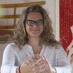

<Row $valign="center">
  <Col xs={3} md={2}>
    <ImgRounded>
      
    </ImgRounded>
  </Col>
  <Col xs={9} md={10}>
    <EntryInfo variant="web" label="Visita" value="[disciplinetaoiste.it](https://disciplinetaoiste.it/)"/>
    <EntryInfo variant="web" label="Instagram" value="[instagram.com/disciplinetaoiste](https://www.instagram.com/disciplinetaoiste/)"/>
    <EntryInfo variant="email" label="Info" value="[info@disciplinetaoiste.it](mailto:info@disciplinetaoiste.it)"/>
    <EntryInfo variant="email" label="Email" value="[barbara@disciplinetaoiste.it](mailto:barbara@disciplinetaoiste.it)"/>
    <EntryInfo variant="phone" label="Telefono" value="[3297904751](tel:3297904751)"/>
  </Col>
</Row>
<Row>
  <Col $columned $initial>
    > Tai chi chuan, Qi Gong, meditazione, Ginnastica posturale taoista

    Barbara Malinverno nasce nel 1974 a Milano, fin da piccola si avvicina alle Discipline Orientali studiando, ricercando e praticando per 35 anni.
    È Maestra Nazionale Coni/Csen di Tai Chi Chuan e Qi Gong, diplomata presso la Nanjing Taiji School in Cina; insegnante per AISM (Associazione Nazionale Sclerosi Multipla) e CISV (Ciechi e Ipovedenti Sportivi
    Varesini); ideatrice del progetto “Invecchiamento Attivo”, del progetto “Ginnastica Posturale Taoista” e del progetto DYL (Design Your Life); autrice del libro “Tai Chi e Postura” edito da Tecniche Nuove; scrittrice per la rivista Medicina Integrata e Cucina Naturale; autrice di video corsi editi da Tecniche Nuove; conduce seminari e residenziali estivi in collaborazione con professionisti nel campo medico ed olistico.
    
    Oggi insegna Tai Chi, Qi Gong, Ginnastica Posturale Taoista e Respiro Verticale a livello nazionale, collaborando con medici occidentali e orientali per dare vita al concetto di una “Nuova Medicina Olistica” in cui esperti, specialisti e professionisti del campo medico, fisioterapico, fitoterapico e del movimento possano dare una nuova veste al concetto di Benessere in armonia con l’ambiente in cui si vive.
    
    Insegna nel Varesotto, a Milano e in giro per il mondo.
    
    I suoi Maestri Zen più importanti, sono Gatti.
  </Col>
</Row>
